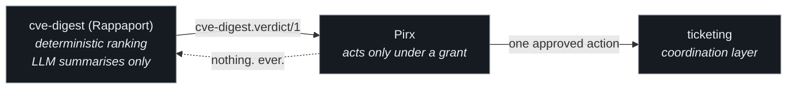
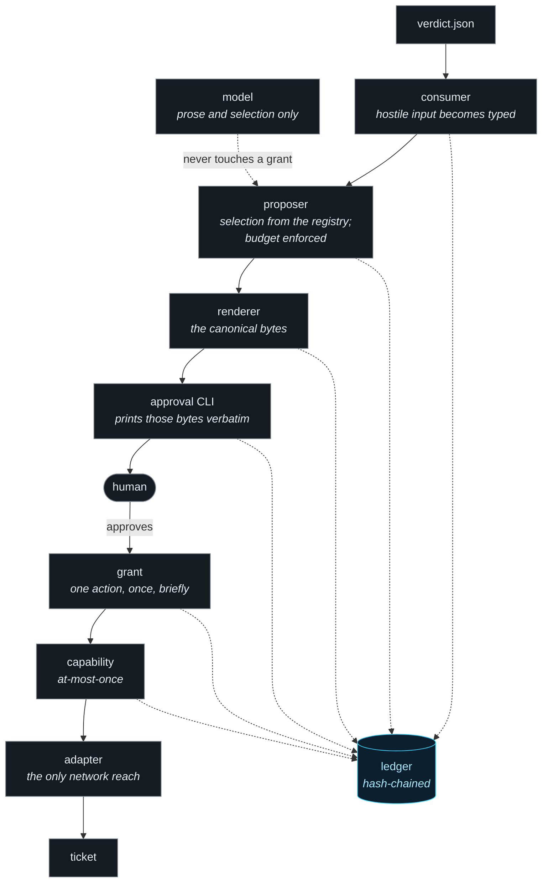

# Pirx

**A write-capable remediation agent whose authority is granted per action,
not per session.**

[](https://github.com/jerzy99jerzy/pirx/actions/workflows/gate.yml)

Pirx consumes vulnerability verdicts from an upstream ranking system and
proposes remediation actions to a human. When the human approves one, Pirx
receives a **grant**: authority bound to the hash of one fully-specified
action, valid once, expiring shortly. It cannot do anything else with it.

The name is Lem's pilot - trusted with a ship precisely because he treats his
own judgement as fallible and checks it against the instruments.

---

## The problem this is built against

Most "human-in-the-loop" agents implement approval as a boolean. A dialogue
appears, a person clicks yes, and from that moment the agent holds whatever
authority it had before the dialogue. The check is real; the authority it
gates is not, because what was approved ("proceed?") and what is then
executed (any action the code can reach) are different things joined only by
the assumption that the agent will do what it said.

The realistic failure is not a forged approval. It is a **real approval,
reused in a context nobody reviewed** - spent on a different target, spent
twice, spent hours later, or given against a summary the agent wrote about
itself.

### The inversion

| Property | Since | How it is enforced |
|---|---|---|
| Zero authority by default | 0.1.0.0 | Every write takes a `SpentGrant`, whose only constructor is the spend function. "Execute without spending" is rejected by the type checker. |
| One grant, one action | 0.1.0.0 | Scope is the SHA-256 of the canonically rendered proposal: verb, target, parameters, and the evidence that justifies it. One byte differs, the grant is void. |
| Single-use and short-lived | 0.1.0.0 | The nonce is burned before the caller can act; expiry runs on a monotonic clock and is checked at spend, not at issue. |
| What was approved is what was shown | 0.1.0.0 | One render function produces the bytes; those bytes are the hash preimage; the terminal prints them verbatim inside a random-boundary frame. A test compares captured stdout against the preimage byte-for-byte. |
| Everything is an event | 0.1.0.0 | A hash-chained ledger records proposals, decisions, grants, spends, refusals, attempts, and results. |
| Approval is measurably attentive | 0.5.0.0 | A grant needs `AttentionEvidence`: a hash-selected field transcribed from the rendered bytes, an answer above a length-derived floor, a session budget. Verified at the surface and again at issuance. Demonstrates the approver operated on those bytes - never that they understood them. |
| Evidence is a type, not a field | 0.6.0.0 | Why an action is warranted arrives as a `Justification` from a source adapter, so a second kind of evidence is an addition rather than a rewrite. The verdict path renders the same bytes it always did, held as a golden preimage. |

**You are here: 0.6.0.0.** The `Since` column is the version in which a
property became enforced, not the version that announced it; the marker is
pinned to `STATUS.json` by the docs audit, so it cannot drift past a bump.

The model never issues, modifies, or validates a grant. From 0.4.0.0 it may
do exactly two things: **select an action by name from the registry**, matched
by exact string membership with no normalisation, and **write a rationale**
that lands inside the renderer's untrusted fence, labelled with its origin. It
supplies no parameters, no target, and no authority. If it returns anything
outside that contract the run refuses rather than falling back, so the
approval screen never hides which mind produced what a human is about to act
on. Model assistance is opt-in, and which mode a run used is recorded in the
ledger either way.

---

## What Pirx does not do

Written before the code, because naming what a control does not buy is harder
than building it.

- **Does not decide what is worth fixing.** Priority arrives in the verdict
  and is never recomputed. An agent that can adjust the ranking justifying
  its own actions has no meaningful constraint left.
- **Does not act without a human.** No autonomous mode, no trusted lane, no
  threshold above which approval is skipped, no configuration flag that could
  create one.
- **Does not patch, deploy, restart, or touch production systems** - not in
  any planned version. The write surface is the coordination layer: ticket
  comments, change records. Pirx does not become a second, worse
  change-control system.
- **Does not authenticate the human.** The ledger carries an `approver_claim`
  from the environment, explicitly marked `authenticated: false`. Identity is
  the identity provider's job; pretending a locally-run agent establishes it
  would be theatre. While approval is a local CLI, whoever has a shell on the
  host holds approval authority.
- **Does not authenticate the verdict payload's origin.** Shape is validated;
  provenance is not. This is threat-model row PT14: an accepted risk with a
  named trigger, and an executable one - a harness attack asserts the
  acceptance, so forgetting it costs a deliberate test change.
- **Does not retain authority between runs.** No long-lived credential
  represents "Pirx is allowed to work here".
- **Does not propose without limit.** A run has a hard proposal budget,
  consumed in the producer's ranking order. An approval surface that presents
  an unbounded queue turns a capability grant back into a checkbox by
  exhausting the human.
- **Does not treat a shown byte as a read byte.** Since 0.5.0.0 an approval
  carries measured attention evidence (PT15): the approver transcribes one
  hash-selected field from the rendered bytes, an approving answer below a
  length-derived floor is refused, and a session's grants are budgeted. The
  honest limit is stated where the code lives: this demonstrates the approver
  operated on the exact hashed bytes, never that they understood them.
- **Does not retry.** A failed or interrupted action is reported, never
  re-executed. Re-issuing authority is a human decision made with the ledger
  in hand.

---

## Where it sits



Nothing flows back toward the ranking system - not at runtime, and not
through development-time automation. A feedback loop between a ranking system
and an agent acting on its rankings is how an agent learns to rank itself
work. Findings that should change priority travel as human-carried files in
`docs/exchange/`; see `docs/FAMILY.md`.

---

## Install and run

Requires Python 3.14 or newer. No third-party runtime dependencies - the Jira
adapter uses `urllib` from the standard library, so there is no supply chain
to audit for the write path.

```bash
git clone https://github.com/jerzy99jerzy/pirx.git
cd pirx
python3 -m venv .venv && source .venv/bin/activate
pip install pytest ruff mypy      # the gate; the package itself needs nothing
```

Run the loop against the bundled sample:

```bash
python -m pirx.cli run examples/verdict-sample.json my-ledger.jsonl
```

With no adapter credentials configured, the run walks the entire pipeline -
parse, propose, render, approve, issue, spend - and stops at the write with
`refusal.adapter_unavailable`. Nothing is written anywhere. That is the
intended first experience: the trust machinery is observable before anything
can act.

Verify the ledger chain afterwards, as a separate command - a verification
and the action it guards never share a pasted block:

```bash
python -c "from pathlib import Path; from pirx import ledger; print(ledger.verify(Path('my-ledger.jsonl')), 'records, chain intact')"
```

### Wiring the ticket adapter

Three environment variables, all or none. There is no partial configuration,
no credential discovery, and no prompting:

```bash
export PIRX_JIRA_BASE_URL="https://your-tenant.atlassian.net"
export PIRX_JIRA_EMAIL="you@example.com"
export PIRX_JIRA_TOKEN="..."
```

### Enabling model assistance (optional)

```bash
export PIRX_ANTHROPIC_API_KEY="..."
```

Unset, the proposer is deterministic. Set, a model selects the action and
writes the rationale. There is no partial mode and no automatic enablement,
and the run records `proposer.mode` in the ledger either way - which mind
wrote the sentence a human approved should never have to be inferred from an
environment variable someone forgot was set.

### Reconciling an interrupted run

If a process dies between a write attempt and its recorded result, the ledger
holds an attempt with no result. Reconciliation asks the target system
whether the write landed, using the idempotency key embedded in the comment
body:

```bash
python -m pirx.cli reconcile my-ledger.jsonl
```

It reports and stops. It never re-executes: the grant is spent, and an
automatic retry carrying authority across a crash is the privilege-persistence
threat wearing a helpful face.

### Exit codes

| Code | Meaning |
|---|---|
| 0 | ran to completion; every approved action executed |
| 2 | refused before any approval: payload at the boundary, or the model outside its contract |
| 3 | a refusal fired inside the loop (expired grant, unregistered action, no adapter, failed attention challenge, reading floor, session budget) |
| 4 | the target system refused a write; authority was consumed and is not refunded |
| 64 | usage error |
| 78 | reconciliation requested with no adapter configured |

---

## Architecture



Dotted lines into the ledger are events. Every step writes to it; **no step
reads it back to make a decision.**

Four trust zones, and the boundaries between them are the design: hostile
input becomes typed objects at the consumer; typed objects become bytes for
human eyes at the renderer and nowhere else; bytes plus a decision become
authority at the grant; everything emits to the ledger and nothing reads it
back to make a decision.

| Module | Role |
|---|---|
| `consumer.py` | Parse and validate `cve-digest.verdict/1` as hostile input |
| `proposer.py` | Deterministic verdict-to-proposal mapping; enforces the budget |
| `proposal.py` | The single canonical renderer and the action hash |
| `approve.py` | Terminal approval surface; prints the hashed bytes verbatim |
| `grant.py` | Issue, verify totally, spend once |
| `registry.py` | The reviewed write surface, as inert data |
| `capability.py` | Execution semantics: at-most-once, idempotency key, no refund |
| `model/` | The model boundary: selection plus prose, validated as hostile input |
| `adapters/` | Ticket adapters; with `model/client.py`, the only network reach |
| `reconcile.py` | Answer "did it land" for interrupted attempts; never retries |
| `session.py` | The shared recording path used by the runner and the harness |
| `ledger.py` | Hash-chained append-only JSONL, plus its verifier |
| `errors.py` | The refusal taxonomy; there is no warning type in this codebase |

Full detail in `docs/ARCHITECTURE.md`.

---

## The harness

`tests/harness/` runs thirty scripted attacks in CI on every push, one per
threat-model row. The pass criterion is uniform: the attack ends in the
correct typed refusal **and** that refusal appears in the ledger the product
wrote. Asserting on the exception alone would test the code path; asserting
on the ledger tests the deliverable.

The catalogue is `tests/harness/CATALOGUE.md`. Two rows are worth knowing
about:

- **A15 passes by design.** It asserts that a perfectly well-formed payload
  from an unauthenticated origin is accepted, which is what PT14 says. When
  the first networked transport lands, this test flips to asserting refusal.
- **A11 documents rather than defends.** It shows that an in-process
  spent-set is per-process, which is why HMAC grants and a durable spend
  store are coupled and must ship in the same version.
- **A21-A29 treat the model as an adversary** holding a copy of the source,
  because from a control standpoint it is indistinguishable from one.

The harness is verified by mutation: mutants are introduced into the product
and the harness is observed failing. The runs are recorded in the sprint
reviews. A verification vehicle that has never been seen to fail is not a
measured control.

---

## Development

```bash
ruff check . && mypy pirx && python -m pytest -q && python tools/docs_audit.py
```

The docs audit checks that `STATUS.json`'s pins match the versions documents
declare, that every version README marks shipped has a review file, that the
attack catalogue and its assertion agree, and that PT numbering has no gaps.
It runs as a fourth CI job.

Branch protection is active on `main` with `enforce_admins`, so every change
goes through a pull request. The merge procedure, including what `strict`
status checks cost and how tags interact with rebase merges, is in
`docs/MERGE-PROCEDURE.md`.

Conventions inherited from the upstream project, adopted verbatim because
they were paid for in incidents: four-segment versioning with the bump as its
own commit; squash merge forbidden; explicit file lists, never `git add -A`;
docstrings register what a module does **not** do, with reasoning; claims are
measured, not asserted; pre-push review in `docs/reviews/` with every finding
dispositioned as fixed, accepted with reasons, or deferred.

---

## Documentation

| Document | Contents |
|---|---|
| `docs/PIRX-PROJECT-BRIEF.md` | Thesis, threat model, version plan, settled decisions and the deferral table |
| `docs/THESIS.md` | Why approval is a capability grant, not a checkbox |
| `docs/THREAT-MODEL.md` | PT1-PT14, each with its control or its named acceptance, and the test that measures it |
| `docs/CONTRACT.md` | The `cve-digest.verdict/1` contract and the consumer-owned compatibility matrix |
| `docs/ARCHITECTURE.md` | Implementation-level assumptions for 0.1.0.0-0.3.0.0 |
| `docs/MERGE-PROCEDURE.md` | Branch protection, rebase, tags |
| `docs/FAMILY.md` | Vendored family practices and the human-carried exchange protocol |
| `docs/TODO.md` | Small non-scope work, each row with a named owner |
| `tools/docs_audit.py` | The documentation consistency check that runs in the gate |
| `docs/reviews/` | Pre-push reviews, one per version, findings dispositioned |
| `docs/exchange/` | Development-level exchange entries with the upstream project |
| `tests/harness/CATALOGUE.md` | The attack catalogue |

---

## Version plan

| Version | State |
|---|---|
| 0.1.0.0 | Trust loop, zero capabilities registered. **Shipped.** |
| 0.2.0.0 | Hostile-agent harness, landing before any write. **Shipped.** |
| 0.3.0.0 | First capability: ticket comment, at-most-once semantics. **Shipped.** |
| 0.4.0.0 | The model enters the proposer, behind the untrusted-prose fence. **Shipped.** |
| 0.5.0.0 | Attentive approval (PT15): content-derived challenge, reading floor, session grant budget, attention evidence verified at issuance. **Shipped.** |
| 0.6.0.0 | Justification-source abstraction; the verdict path becomes adapter #1, behaviour unchanged. **Shipped.** |
| 0.7.0.0 | `pirx-gate`: stdio MCP proxy, first gated tool, PT16-PT18, process identity (see `docs/PIRX-GATE-DESIGN.md`) |
| 0.8.0.0 | `pirx verify` report with the fatigue signal; attestation export (EU AI Act art. 14 / ISO 42001 language) |

Deferred with named owners, not forgotten: HMAC grants plus a durable spend
store (owned by the first multi-process version, coupled - either both or
neither); a detached signature on the verdict payload (first networked
transport); a remote append-only ledger sink; batch approval (refused as a
design until replay, staleness, and substitution are proven in production).

---

## Measured claims

This project's own rule is that a number appears in documentation only when
the code produced it. Accordingly:

- Gated on Python 3.14.6 (macOS) and in CI on 3.14: ruff clean, mypy strict
  clean, **140 tests passing**, of which 30 are harness attacks, plus a docs
  audit that was itself verified by four mutants before being trusted.
- The ledger chain detects record edits and interior gaps. It does **not**
  detect truncation of the tail; a test asserts that limitation so nobody
  claims otherwise. Every append is flushed and fsynced, and a test measures
  the fsync rather than trusting the docstring.
- The import-allowlist scrape is a regression tripwire for the honest
  mistake, not a proof: `getattr`, `importlib`, or a wrapper library defeats
  any static check, and the test says so in its own docstring.
- The Jira adapter's request construction, credential encoding, idempotency
  trailer, and response handling are tested against an injected transport.
  That a live Jira accepts them is **not** tested; see review finding F15.
- The model client is tested the same way and with the same limit: reply
  validation, exact-match selection, bounding, and refusal-without-fallback
  are measured; that a live API returns what the tests assume is not.

---

## Licence

Apache License 2.0. See `LICENSE`.
