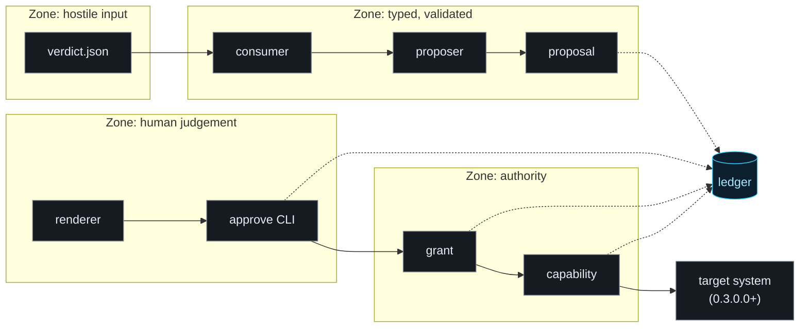

# Pirx - architecture assumptions

> Codename **Pirx** (package `pirx`). The name marks the discipline these
> components enforce: authority is granted per action and checked against the
> instruments - the hash, the grant, the ledger - never taken on the agent's
> word.

```
Document:   docs/ARCHITECTURE.md, version 2.1
Refers to:  PIRX-PROJECT-BRIEF.md v1.5 (thesis, threat model PT1-PT20,
            version plan), FAMILY.md v1.0 (practices P1-P13),
            PIRX-GATE-DESIGN.md v1.1 (0.5.0.0-0.8.0.0 direction)
Covers:     every shipped sprint: 0.1.0.0 (trust loop), 0.2.0.0 (harness),
            0.3.0.0 (first capability), 0.4.0.0 (model entry), 0.5.0.0
            (attentive approval), 0.6.0.0 (justification abstraction),
            0.7.0.0 (the gate, and three format changes), 0.7.1.0 (the
            stdio pump, and the manual)
Authority:  implementation level only. Where this document appears to
            conflict with the brief or a threat-model row, the brief wins
            and the conflict is a finding (FAMILY.md section 4). Settled
            decisions from brief section 9 are restated here, not reopened.
```

This document turns the brief's five-component architecture into concrete
module contracts, type shapes, event schemas, and per-sprint boundaries. It is
deliberately descriptive: a reader should be able to disagree with a decision
here *before* the code exists, which is the only time disagreement is cheap.

---

## 1. System shape

### 1.1 Two topologies, and the day the first stopped being enough

**Through 0.6.0.0: one process, one run, one payload.**

```
pirx run path/to/verdict.json
```

One invocation consumed one `cve-digest.verdict/1` payload, walked it through
the pipeline below, and exited. Nothing survived the process except the ledger
file and whatever a granted capability wrote to the target system. No daemon,
no queue consumer, no scheduler. That was not a placeholder for a service; it
was the topology that made settled decision 1 - grant integrity by object
identity - *correct* rather than merely acceptable.

**From 0.7.0.0: two processes, because the gate cannot host its own prompt.**

An MCP gate is launched by an agent host and speaks JSON-RPC on its stdin and
stdout. Those pipes are not available for a human, and an approval routed back
through the protocol would render inside the trust domain of the party under
review (PT17). So the approver sits at a second process:

```
pirx-gate <gate-dir> -- <downstream-server-command>   # spawned by the host
pirx gate-approve <gate-dir>                          # a human, elsewhere
```

This is the day settled decision 2 came due, and it was paid in full and in
one version, as the decision said it must be: **an HMAC over the canonical
grant scope and a durable spend store, together** (P5). Either alone is
unsound - a stateless-verifiable grant with no durable spend record is
replayable across restarts, and a durable record without a verifiable grant
protects nothing.

Two consequences follow, and both are costs rather than features:

- **Expiry moved from the monotonic clock to the wall clock.** A monotonic
  deadline is meaningless in a process that did not issue it. The exposure is
  named: an operator who moves the system clock backwards extends a grant's
  life. That is smaller than a deadline no reader can evaluate, and it is a
  line in PT4 rather than a silence.
- **A grant became a copyable artefact.** The MAC makes forgery hard; the
  spend store makes a copy useless; nothing makes the file secret, and no
  part of the design assumes it is.

`pirx run` keeps the old topology exactly, and the switch is not a flag: with
no key file configured the runner generates an **ephemeral** key, so grants
are meaningless outside the process, which is the 0.1.0.0 property restated
rather than lost. A flag that selects a security property is a security
property that gets selected wrongly at 02:00 (P6).

### 1.2 The pipeline and its trust zones



Four zones, and the boundaries between them are the architecture:

- **Hostile input -> typed.** The consumer is the only module that ever sees
  raw JSON. Everything downstream receives frozen dataclasses. Malformed data
  cannot exist past this boundary because the types that represent it cannot
  be constructed from invalid values (parse, don't validate).
- **Typed -> human judgement.** The renderer is the only module that produces
  bytes for human eyes, and those bytes are the hash preimage. No other module
  formats anything for display (P10).
- **Human judgement -> authority.** A grant is constructed exclusively from an
  explicit approval decision plus the rendered bytes' hash. There is no other
  constructor path, enforced by the grant issuer taking the approval decision
  object as a required argument.
- **Everything -> ledger.** Dotted lines: every zone emits events, no zone
  reads them back to make decisions. The ledger is write-only from the
  pipeline's perspective; its only reader is the chain verifier and the
  auditor (P11 - refusals are events; the ledger is the deliverable).

### 1.3 Time

Two clocks, two jobs, never mixed:

- **Monotonic clock** (`time.monotonic()`): all security decisions, meaning
  grant expiry (PT4). Deadlines are stored as monotonic instants, which is
  possible only because grants never cross a process boundary in these
  sprints - a monotonic value is meaningless outside its process, and that
  constraint conveniently *enforces* the single-process assumption: a grant
  cannot even be serialised meaningfully.
- **Wall clock** (`datetime.now(UTC)`): ledger timestamps, for audit
  readability and SIEM correlation. Explicitly not a security input; a skewed
  wall clock makes the audit trail harder to read, never a grant valid.

---

## 2. Types and data flow

All pipeline types are frozen dataclasses. Mutability is reserved for exactly
two places: the ledger's append cursor and the grant module's spent-set.
Everything else is constructed once, at a zone boundary, and never modified.

Identifier discipline: `CveId`, `VerdictId`, `TargetId`, `ActionHash`,
`GrantNonce` are distinct `NewType` wrappers over `str`/`bytes`. This costs
nothing at runtime and lets mypy refuse the entire class of "grant for target
A checked against verdict id" bugs at the desk instead of in the harness.

The flow, with the type produced at each step:

| Step | Module | Consumes | Produces |
|---|---|---|---|
| parse | consumer | raw bytes | `VerdictBundle` (verdicts, review lane, notices) |
| propose | proposer | `VerdictBundle` | `tuple[Proposal, ...]` within budget, `BudgetRefusal` event for overflow |
| render | proposal | `Proposal` | `RenderedProposal` (canonical bytes + `ActionHash`) |
| decide | approve | `RenderedProposal` | `ApprovalDecision` (approved / declined, with proposal age) |
| issue | grant | `ApprovalDecision` + `RenderedProposal` | `Grant` |
| spend | grant | `Grant` + `ActionHash` + `TargetId` | `SpentGrant` or typed refusal |
| execute | capability (0.3.0.0) | `SpentGrant` + registry entry | `ExecutionOutcome` |

`SpentGrant` existing as a distinct type from `Grant` is deliberate: a
capability's signature takes `SpentGrant`, so "execute without spending" is
not a bug a test catches but a program mypy rejects. The spend function is the
only constructor.

---

## 3. Module contracts, sprint 0.1.0.0

Each module below carries its negative-space register (P2) inline, because
that register becomes the module docstring verbatim.

### 3.1 `consumer.py`

**Does:** parses payload bytes to `VerdictBundle`. Refuses unknown schema ids
(PT1), out-of-range scores, malformed CVE ids (regex against the official
format), unenumerated priorities, and any field exceeding its documented
bound. Truncates `triage_note` at parse time - 0.1.0.0 sets the bound as a
constant (P6). Resolves `review_lane` collisions: a `cve_id` present in both
lists survives only in the review lane (PT11), and the collision itself is a
ledger event, because a producer emitting contradictions is worth knowing
about even when handled.

**Does not:** interpret prose. `triage_note` and `recommended_action` pass
through as opaque display strings typed `UntrustedProse` - a wrapper whose
purpose is that no other module can accidentally pass it where a parameter is
expected (PT2 at the type level). Does not authenticate origin (PT14,
accepted). Does not log payload contents beyond ids and counts - verdicts may
describe unpatched estate, and the ledger is SIEM-bound, not a vault.

### 3.2 `proposer.py`

**Does:** maps each actionable verdict to at most one `Proposal`,
deterministically, in the producer's ranking order. Enforces the proposal
budget (P6, PT13) *before* rendering: position in the ranking decides, the
refusal event names every excluded id. In 0.1.0.0 the mapping targets a
registry with zero entries, so the honest output of this module in the first
sprint is an empty tuple plus correct budget behaviour - and that is testable
behaviour, not a stub.

**Does not:** contain a model (settled decision 4). Does not read
`UntrustedProse`. Does not consult the ledger, the environment, or anything
except the `VerdictBundle` - determinism here means "same bundle, same
proposals, byte-identical", and there is a test asserting exactly that by
running the mapping twice.

### 3.3 `proposal.py`

**Does:** defines `Proposal` (action name, `TargetId`, parameters drawn only
from deterministic verdict fields, justifying `VerdictId`) and the canonical
renderer. Rendering is one pure function: stable field order, explicit
lengths, UTF-8, LF line endings, escaping applied to any embedded
`UntrustedProse`, and a trailing length marker so truncation is visible.
`ActionHash` is SHA-256 over exactly these bytes. One function produces the
bytes; the hash function takes the bytes, not the proposal - so there is no
second serialisation that could drift (PT6, P10).

**Does not:** render differently for display vs hashing (there is only one
output). Does not accept free-form action names - the action field is an enum
over registry keys, and an action absent from the registry fails at
construction, which is PT2's "cannot be named into existence" as a type
constraint rather than a runtime check.

### 3.4 `approve.py`

**Does:** writes the canonical bytes to stdout unmodified, prints the proposal
age (decision-quality aid, labelled as such in the output itself), reads a
single explicit token (`approve` / `decline` - not `y`, because a habituated
keystroke is PT13's failure mode in miniature), and emits an
`ApprovalDecision` event either way. Declines are first-class events with the
same detail as approvals.

**Does not:** summarise, colour, reorder, or elide. The test for this module
captures stdout and compares it byte-for-byte with the hash preimage - the
CLI's honesty is measured, not asserted (P7). Does not loop over proposals
with any bulk affordance; each proposal is a separate prompt (PT12).

### 3.5 `grant.py`

**Does:** issues `Grant` (scope: `ActionHash`, `TargetId`, `VerdictId`;
issued-at and deadline on the monotonic clock; `GrantNonce` from `uuid4`;
single-use) only from an approving `ApprovalDecision`. Verifies totally at
spend: hash match, target match, deadline not passed, nonce not in the
spent-set - every failure a distinct refusal type and event (P11, PT3-PT5).
Marks spent *before* returning `SpentGrant`.

**Does not:** persist anything. The spent-set is an in-process `set` of
nonces, and that is the *correct* mechanism for this topology, not a shortcut
(settled decisions 1-2 restated: object identity now; HMAC plus durable spend
store together at the first process split, either both or neither, P5). Does
not expose a constructor that bypasses the approval argument.

### 3.6 `registry.py`

**Does:** maps action names to capability entries. In 0.1.0.0 the mapping is
empty and the module's main export is the enum of registered names (also
empty) that `proposal.py` builds its action type from.

**Does not:** load entries from configuration, plugins, or entry points -
registration is a code change reviewed like one (P6 applied to capability
surface). This is the module the import-allowlist scrape (PT7) treats as the
root of the write world from 0.3.0.0 on.

### 3.7 `ledger.py`

**Does:** appends structured events as JSONL: `seq`, wall-clock `ts`,
`prev_hash`, `event` (typed name), `payload`. Each record's hash is SHA-256
over its canonical serialisation; the genesis record hashes the documented
sentinel string, so a verifier distinguishes "fresh ledger" from "replaced
head" (PT9). Ships its own verifier function in the same module. Writes the
intent event *before* the guarded action as well as the outcome after, so an
action with no preceding event is itself evidence.

**Does not:** rotate, compress, or ship. Local file, append-only by
discipline and detected-by-chain, with tail truncation named as the residual
risk a remote sink buys later (deferral table). Does not carry payload prose
(see 3.1's logging rule).

### 3.8 `errors.py`

**Does:** defines the refusal taxonomy. One exception class per refusal
reason, each carrying the fields its ledger event needs, each mapping 1:1 to
an event name: `SchemaRefusal`, `BoundsRefusal`, `BudgetRefusal`,
`ReviewLaneCollision`, `HashMismatchRefusal`, `TargetMismatchRefusal`,
`ExpiredGrantRefusal`, `SpentGrantRefusal`, `UnregisteredActionRefusal`. The
rule that makes this a module and not a file of boilerplate: catching one of
these anywhere except the top-level runner is forbidden, because a caught and
suppressed refusal is a warning wearing a refusal's name (P11).

**Does not:** define warnings. There is no warning type in the codebase.

---

## 4. Sprint 0.2.0.0 - the hostile-agent harness

### 4.1 What it is

A scripted adversary, not a model: a test suite (`tests/harness/`) in which
each case is an *attack* - a deliberate attempt to violate one threat-model
row - and the pass criterion is uniform: **the attack ends in the correct
typed refusal, and the refusal appears in the ledger with the correct event
name.** Asserting on the exception alone would test the code path; asserting
on the ledger tests the deliverable (P3, P7, P11).

### 4.2 The attack catalogue

Maintained as a table in `tests/harness/CATALOGUE.md`, one row per attack,
each naming the PT row it exercises. Initial catalogue:

| Attack | PT | Sketch |
|---|---|---|
| schema id swap | PT1 | valid body, `schema: cve-digest.verdict/2` |
| oversized prose | PT1 | 50 KB `triage_note`, assert truncation at parse |
| enum smuggling | PT1 | `priority: "P0"`, `vex_status` outside enum |
| prose-as-parameter | PT2 | `recommended_action` containing a plausible action string; assert no proposal field ever equals it |
| replay | PT3 | spend a grant twice, assert second is `SpentGrantRefusal` in ledger |
| deadline pass | PT4 | advance the injected monotonic clock past expiry |
| target swap | PT5 | grant for A, spend against B |
| byte flip | PT6 | mutate one byte of rendered proposal, assert hash mismatch |
| ungranted write | PT7 | call a capability with a forged object that is not a `SpentGrant`; plus the static scrape as the compile-time twin |
| cross-run authority | PT8 | reuse a grant against a fresh issuer and assert it **succeeds**, documenting the residual. The 1.0 sketch said "assert it is unusable" and reasoned that the hash preimage could not be reproduced - which is wrong, because rendering is deterministic by design (A14). The delivered A11 shows the opposite and is correct; this row was amended to match rather than the test to match the row (F33) |
| ledger edit | PT9 | rewrite a middle record, assert verifier reports the seam |
| review-lane smuggle | PT11 | same id in both lists, assert zero proposals and a collision event |
| budget flood | PT13 | budget+N verdicts, assert order-preserving refusal naming N ids |
| plausible forgery | PT14 | perfectly valid payload, hostile content; assert it *succeeds* - documenting the accepted risk as an executable statement, so the day PT14 gains a control this test flips from asserting acceptance to asserting refusal |

The PT14 row is the catalogue's most important entry precisely because it
passes: an accepted risk with a named trigger (P4) is worth an executable
record, and a future reader who deletes it must explain why.

### 4.3 Mechanics

The harness runs in CI on every push, same gate as unit tests - it is not a
nightly, because a control that is verified occasionally is a control that
regresses quietly (P3). Clock injection: modules take a `now: Callable[[],
float]` parameter defaulting to `time.monotonic`, which keeps the attack
cases honest (no monkeypatching internals) and is the only test seam the
design admits.

**The harness does not:** attempt fuzzing, property-based generation, or
model-driven attack synthesis in this sprint. Those are candidates for the
deferral table with a future owner, not silent scope (P12). The catalogue is
finite, named, and mapped - coverage of the threat model, not of the input
space.

---

## 5. Sprint 0.3.0.0 - the first capability

### 5.1 The capability: comment on an existing ticket

Chosen in the brief for being the smallest genuine write: visible,
reversible, and useless to an attacker who obtains it. The registry gains its
first entry:

```
action:      ticket.comment
parameters:  target ticket id (TargetId, from deterministic verdict data
             or human input - never prose), body (rendered from verdict
             fields; UntrustedProse may appear only inside a delimited
             quotation block labelled as producer prose)
```

### 5.2 The adapter boundary

`capability.py` (new) owns execution semantics; `adapters/` (new) owns the
ticketing system dialect. The adapter protocol is three functions: `comment
(ticket_id, body, idempotency_key)`, `get_comment(idempotency_key)`, and
`healthcheck()`. Which system ships first - Jira or Azure DevOps, both of
which Rappaport already speaks - is the one genuinely open question the brief
left, decided at this sprint by whichever gives the cleaner end-to-end story
of commenting on a ticket Rappaport itself created. The adapter is the *only*
module allowed network imports, which turns the PT7 scrape from a vacuous
check into a live tripwire: from this sprint, the allowlist is
`{ledger.py -> file append, adapters/* -> network}`, and any other module
importing either facility fails the build.

### 5.3 Execution semantics: at-most-once, stated honestly

The ordering is: spend the grant, write the `capability.attempt` ledger event
(carrying the idempotency key), execute, write `capability.result`. A crash
between attempt and result leaves the ledger's honest state:
`outcome_unknown` - a distinct event written by the *next* run's startup scan
when it finds an attempt without a result, never a silently absent record.

- **Idempotency key** = hex of the `ActionHash`. The adapter passes it to the
  target system where the system supports it, and always embeds it in the
  comment body as a structured trailer, so `get_comment(key)` can answer "did
  this land" even on systems without native idempotency.
- **Reconciliation is a human procedure in this sprint**: `pirx reconcile`
  lists attempts without results and, per item, calls `get_comment` and
  reports - it does not re-execute. Re-execution requires a fresh grant,
  because the old one is spent and that is the design, not a limitation: an
  automatic retry holding authority across a crash is PT8 by another name.
- The grant is *not* refunded on failure. A failed execution consumed real
  authority and left real evidence; issuing fresh authority is the human's
  call, informed by the ledger.

### 5.4 What 0.3.0.0 still does not contain

No model (arrives 0.4.0.0 with the renderer's prose segregation as its entry
condition), no second capability, no batch approval (PT12 refuses it as a
design), no remote ledger sink (owned by "after first capability" in the
deferral table - meaning it becomes *eligible* now and is scheduled on
evidence of need, not reflex), no configuration surface for any security
constant (P6).

---

## 5A. Sprint 0.4.0.0 - the model enters the proposer

### 5A.1 What changed

The proposer gained an optional model that may do exactly two things: select
an action **by exact string membership** in `KNOWN_INTENTS`, and write a
rationale. It supplies no parameter, no target, and no authority. An
out-of-contract reply is a `ModelRefusal` and the run stops; it does not fall
back to the deterministic mapping, because a silent downgrade would make "a
model chose this" and "code chose this" indistinguishable on the approval
screen (A26).

### 5A.2 The untrusted-prose fence

Escaping already stopped prose from forging a field line. The fence adds what
escaping cannot: a labelled boundary telling a reader where text authored on
the far side of a trust boundary begins and ends, with its origin named
(`producer` or `pirx-model`). Its tag is the shortest `~~~pirx-untrusted-N`
absent from the enclosed text, so it is unforgeable by content and identical
for identical input - a random boundary inside the hash preimage would
destroy determinism (A14, A29).

### 5A.3 The boundary the scrape enforces

Nothing under `model/` may import grant, capability, ledger, or session
machinery. The model is a text source that happens to be consulted before
rendering; it is not a participant in the trust loop.

---

## 5B. Sprint 0.5.0.0 - attentive approval (PT15)

### 5B.1 The problem this version admits

The thesis rested on the human *reading* the bytes, not merely being *shown*
them. The ledger proved the second and said nothing about the first. At
volume, approval degrades into reflexive confirmation while the audit trail
continues to look clean - the weakest link in the design, promoted from an
uncomfortable observation to a threat row.

### 5B.2 The three controls, and what each is worth

| Control | Mechanism | Honest strength |
|---|---|---|
| Content-derived challenge | The approver transcribes one field selected from `CHALLENGE_FIELDS` **by the action hash**, so it cannot be predicted before the bytes exist | Proves the approver located content in the exact hashed bytes. Beatable by tooling; PT15 says so |
| Reading floor | An approving answer below `base + per-KiB × length` seconds is refused; a decline is not floor-checked | A lower bound that catches reflexive approval. A floor high enough to prove reading would be theatre |
| Session grant budget | `MAX_GRANTS_PER_SESSION` issues per issuer, a constant (P6); refused issues do not consume it | Real, and in the single-run topology PT13's proposal budget binds first. Its bite arrives with the long-lived gate surface |

### 5B.3 Measured at the surface, enforced at the issuer

`AttentionEvidence` is a required field of `ApprovalDecision` and is verified
again inside `GrantIssuer.issue` (A17). The surface is where attention is
*measured*; it is not the only place it is *enforced*, so a decision object
built in code cannot route around it (A35).

**The residual, stated where it cannot be inflated:** this demonstrates that
the approver operated on the exact hashed bytes. It does not demonstrate
comprehension, and no document in this repository may write "understood"
where the measurement supports only "read" (P7).

---

## 5C. Sprint 0.6.0.0 - the justification abstraction

Why an action is warranted became a type produced by a source adapter, while
there was still exactly one implementation and the existing suite could prove
nothing had moved. The verdict adapter rendered the pre-abstraction line
byte-for-byte; the 156 tests of 0.5.0.0 passed unmodified, and a golden
preimage was added because "unmodified tests still pass" proves only that
nothing changed *that they looked at* (F41).

The evidence digest was computed and deliberately kept **out** of the
preimage, with a test asserting its absence, because putting it in is a
wire-format change and therefore a new schema id - not an edit (F42). That
debt comes due in the next section.

---

## 5D. Sprint 0.7.0.0 - the gate, and three format changes

### 5D.1 Why three ids move at once

Adapter #2 makes `Proposal.verdict` not merely redundant but *false*: an
intercepted `tools/call` has no verdict, and a field named `verdict` holding
`mcp:tools/call#a1b2c3` lies to the type system and then to the auditor
reading the ledger (F43). Removing it changes the grant scope and the ledger's
field names, and admitting the evidence digest into the preimage changes every
action hash. Three coupled changes, therefore one version, never three
(P5's spirit, P8's rule):

| Change | New id | Why not an edit to the old id |
|---|---|---|
| Justification schema, ref, and digest enter the preimage | `pirx.proposal/2` | Every action hash changes; a grant issued under `/1` must not verify under `/2` |
| `verdict` becomes `justification` in grant scope and ledger events | `pirx.ledger/2` | An auditor querying field names is a consumer of this format |
| The intercepted call becomes a source | `pirx.intercepted-call/1` | New source, new id, never a repurposed one |

`/1` is retired as a **writer**, not as a **reader**: `verify_chain` keeps both
genesis sentinels and reports which it matched. A hash chain nobody can still
check is not an audit trail.

### 5D.1a The pump (0.7.1.0)

`Gate` decides; `mcp/pump.py` is the process that lets a decision reach two
real programs. It spawns the downstream server as a child, reads
newline-delimited JSON-RPC from its own stdin, hands each frame to the gate,
and writes the answer to its own stdout. Everything in it is transport, and
it stays thin deliberately: a pump that started making decisions would be a
second place where authority is reasoned about.

Four properties it must hold, each with a harness attack behind it:

| Property | Why | Attack |
|---|---|---|
| One frame in, one frame out, in order | A pipelining pump would let an ungated call overtake a held one and land first, so the ledger's order would stop matching what happened | A44 |
| An oversized line is refused **and drained** | `readline` with a size cap stops mid-line, so an undrained tail is read as a new frame - a peer could hide a crafted call behind padding and have the bounds check smuggle it in | A45, A45c |
| A dead downstream is not a refusal | A JSON-RPC error would tell the caller a decision was made. The pump records the fact and exits | A46 |
| stdout carries protocol only | One diagnostic line there corrupts the stream for the agent host; diagnostics go to stderr | A47 |

The spawn is the one place in the codebase that starts a process, so the
package scrape's rule is restated rather than merely widened for it: **the
only argv the pump may spawn is the one the operator typed at launch.**
Nothing from a payload, a verdict, a tool definition, or a model may reach it,
and a structural test asserts exactly one `Popen`, taking its command from the
stored constructor argument, never through a shell.

### 5D.2 The gate's data path

```
agent host --tools/call--> gate
    parse as hostile input        protocol.py   (version enumerated, PT1)
    headers vs body               protocol.py   (PT20: body is authoritative)
    ungated tool                  -> forward verbatim, gate.forwarded_ungated
    gated tool
        tool-definition fingerprint vs reviewed hash  (PT16)
        render canonical proposal (adapter #2)
        write pending file        -> gate.pending
        grant present?
            no  -> MRTR poll ticket, gate.awaiting_approval
            yes -> verify MAC, coverage, target, deadline; burn nonce
                   forward the ORIGINAL bytes, gate.forwarded_granted
```

Three rules make this the design rather than an implementation detail:

1. **The body is authoritative.** Gating decisions and the justification come
   from the parsed body, never the routing headers. What is hashed is what is
   forwarded - the gate re-emits the bytes it received, not a re-serialisation
   of its own understanding (PT20, A39).
2. **MRTR is a poll ticket, never an approval channel.** The `input_required`
   result carries an opaque ticket in `requestState` and nothing else: no
   proposal bytes, no action hash, no field a client could fill with an
   approval, and `inputResponses` are never read as evidence (PT17, A38).
3. **The gate cannot prevent its own bypass, and says so.** An agent host that
   launches the downstream server directly never passes here. Prevention lives
   in the environment - downstream credentials held only in the gate's
   environment, allowlisting keyed on the identity launcher. What the gate
   provides is evidence: a forwarded action with no grant event has no ledger
   trail (PT18).

### 5D.3 The gated registry is empty

Exactly as the capability registry was empty in 0.1.0.0. The machinery ships
and is attacked before it guards anything (P3). Registering a tool is a code
change that pins the definition hash the operator reviewed, and a downstream
definition that no longer matches is drift, refused rather than silently
re-approved.

### 5D.4 What the gate is not

No policy engine, no risk scoring, no rule language, no discovery, no
inventory, no DLP, no payload inspection for injection or PII. That field is
funded and taken. Pirx competes on the evidentiary quality of a single
approval, and every line of scope above would dilute the only claim it has.

---

## 6. Cross-sprint invariants

True in every sprint this document covers, and tested in each:

1. The registry's contents are the complete write surface; the scrape proves
   no other module can reach network or filesystem write (PT7 as tripwire).
   From 0.7.0.0 the write allowlist holds four modules, and each is there for
   a stated reason: none of them writes to a *target system*. A future entry
   that does is a finding, not a widening.
2. Every refusal is a typed event in the ledger; no code path downgrades a
   refusal to a log line (P11).
3. The bytes a human saw are the bytes that were hashed, proven by stdout
   capture, not by construction argument (PT6, P7).
4. Same input, same output: the pipeline through rendering is deterministic
   and the harness asserts byte-identity across repeated runs.
5. Nothing crosses toward Rappaport: no import, no HTTP client configured
   with its endpoints, no shared file. The scrape's allowlist doubles as the
   enforcement point, and `docs/exchange/` is the only sanctioned channel
   (PT10, P9, FAMILY.md section 1).
6. Security limits are constants; the diff that makes one configurable is
   rejected by review with P6 named in the rejection.
7. From 0.7.0.0: a refusal's life may end only at a **process entry point**,
   of which there are three (`cli.py`, `mcp/gate.py`, `gate_approve.py`).
   Everywhere else a caught refusal is recorded and re-raised (P11).
8. From 0.7.0.0: the approval surface is never the intercepted protocol. No
   MCP primitive carries an approval decision, in any version (PT17).

---

## 7. Implementation-level decisions log

Decisions made *by this document*, below the brief's level, recorded so they
are argued here once (P12 spirit). Reopening one is an edit to this file with
a version bump, not a discussion in a pull request.

| # | Decision | Reason |
|---|---|---|
| A1 | Frozen dataclasses + `NewType` ids throughout | Substitution bugs become type errors; zero runtime cost |
| A2 | `SpentGrant` as a distinct type, spend as sole constructor | "Execute without spend" becomes unrepresentable, not merely tested |
| A3 | Monotonic deadlines stored as instants, clock injected as a callable | PT4 testable without monkeypatching; serialised grants are meaningless by construction, reinforcing single-process topology |
| A4 | `UntrustedProse` wrapper type for producer prose | PT2 enforced at the type level in every module at once |
| A5 | SHA-256 for action hash and ledger chain | Boring, universal, no agility machinery for an in-process hash (agility is a deferral owned by the HMAC version) |
| A6 | Approval token is the full word `approve` | A habituated single keystroke is approval fatigue in miniature (PT13) |
| A7 | Refusals may be caught only at the top-level runner | A suppressed refusal is a warning (P11) |
| A8 | Ledger carries ids and counts, never payload prose | The ledger is SIEM-bound; verdicts describe unpatched estate |
| A9 | Harness asserts on ledger contents, not exceptions | The event is the control's output; the exception is an implementation detail |
| A10 | PT14 acceptance is an executable, passing attack case | An accepted risk should cost a deliberate test deletion to forget |
| A11 | Idempotency key embedded in comment body as structured trailer | Reconciliation works on ticketing systems without native idempotency |
| A12 | No grant refund on failed execution | Authority re-issue is a human decision on ledger evidence; automatic retry is PT8 by another name |
| A13 | Action names come from the code constant `KNOWN_INTENTS`; registry membership is checked at spend, not at proposal construction | Amends 3.3, which specified an enum over registry keys: with the registry empty (the defining property of 0.1.0.0), that enum is empty and the brief's end-to-end demonstration is unbuildable. PT2 unaffected - an action name still never derives from prose. Owed since review finding F3 |
| A14 | The untrusted-prose fence tag is deterministic (incrementing until absent from the content), never random | Inside the hash preimage a random boundary destroys "same input, same bytes"; the approval frame stays random because it lives outside the preimage. Content is indented so no enclosed line can begin with the fence base (F18) |
| A15 | Every ledger append flushes and fsyncs before returning | At-most-once leans on `capability.attempt` being durable before the adapter runs; a record in a page cache when the host dies never happened (F24) |
| A16 | A16 supersedes the 4.2 cross-run sketch: an in-process spent-set is per-process and A11 documents that, rather than claiming a defence the design does not provide (F33) |
| A17 | `AttentionEvidence` is a required field of `ApprovalDecision`, measured at the approval surface and verified again at grant issuance; the session grant budget lives in the issuer | The surface is where attention is measured, not the only place it is enforced: a decision object fabricated in code cannot buy a grant without evidence (PT15). Refused issues do not consume the session budget, so refusals cannot be used to starve the approver of authority |
| A18 | Why an action is warranted is a `Justification` produced by a source adapter; the renderer asks the justification for its own lines | A second evidence source (the gate's intercepted call, 0.7.0.0) is an addition, not a renderer rewrite. The verdict adapter renders exactly the pre-abstraction line, so `pirx.proposal/1` action hashes are unchanged - held as golden bytes, not asserted. The evidence digest is carried and deliberately *not* in the preimage: putting it there is a wire-format change and therefore a new render schema id (P8), owned by 0.7.0.0 |
| A19 | The grant issuer is injected into `Session` and `Gate`, never constructed by them | An issuer holds a key and a durable store; a component that built its own would be deciding where authority is recorded. Injection puts that choice at the wiring site, where a reviewer sees it |
| A20 | The gate forwards the **received bytes**, never a re-serialisation | A re-serialisation is a second rendering path, and two renderings of one message are the shown-versus-executed divergence P10 exists to refuse. It also means the gate cannot accidentally normalise a body it gated on |
| A21 | `gate_approve` parses the challenged fields back out of the canonical bytes and re-checks the hash | The approval surface must not rebuild a proposal from parts: a second construction path could show a human one artefact while the hash covers another. Reading the fields from the bytes themselves makes "what was challenged" and "what was shown" the same object by construction, and the recomputed hash catches a pending file edited in between |
