# Pirx Gate - design brief: MCP interception and proof-of-read

```
Document:   docs/PIRX-GATE-DESIGN.md, version 1.1
Status:     accepted; realised in PIRX-PROJECT-BRIEF.md v1.4 section 6.
            v0.1 was the pre-acceptance draft; changelog at the end
Refers to:  PIRX-PROJECT-BRIEF.md v1.4, FAMILY.md v1.0, THREAT-MODEL.md PT15
Research:   MCP facts below verified against sources on 2026-08-08; labelled
Convention: epistemic labels [measured] / [inference] / [speculation] on
            load-bearing claims, per P7
```

This document turns the strategic reframe from the session handoff into a
buildable plan: Pirx repositioned as a gate that intercepts a high-impact MCP
tool call and releases it only under a cryptographically bound, measurably
attentive human grant. It does not re-argue settled decisions; where it
touches one (the 0.5.0.0 scope), it says so and asks.

---

## 1. Thesis, extended

The original thesis stands unqualified, per P1:

> **Approval is a capability grant, not a checkbox.**

The extension, which the reframe identified as the unclaimed ground:

> **A grant that cannot be shown to be attentive is not evidence.**

Everyone in the gateway market logs *that* a human approved. The ledger
already proves *what* was bound to what executed (hash binding, PT3-PT6).
The missing third leg is whether the review was real rather than
rubber-stamped, and B1 says this is the weakest link of the whole design.
The extension makes B1 a threat with controls instead of an accepted
embarrassment.

Honest limit, stated up front so it cannot be quietly inflated later:
proof-of-read demonstrates that the approver **operated on the exact hashed
bytes** (looked at them, extracted content from them). It does not and cannot
demonstrate comprehension. Any future wording claiming "understood" instead
of "read" is a P7 violation.

---

## 2. What the research established

### 2.1 MCP, current state [measured, 2026-08-08]

- Current specification: **2026-07-28**, the largest revision since launch.
  Stateless protocol core (protocol-level sessions and `Mcp-Session-Id`
  removed), header-based routing, Multi Round-Trip Requests (MRTR) for
  interactive tools, formal extensions framework. Older HTTP+SSE transport
  is deprecated.
- Transports: **stdio** (local, gate spawns the server as a child) and
  **Streamable HTTP**. stdio interception is fully implementable in stdlib;
  Streamable HTTP server-side is where the stdlib-only constraint will be
  tested.
- The interception point is unambiguous: a `tools/call` JSON-RPC request
  carrying `name` + `arguments`. Tool definitions (name, description, JSON
  Schema) arrive via `tools/list`.
- Elicitation exists as a protocol primitive for user input / approvals,
  routed through the **calling agent's host**. This matters for section 5.3.

### 2.2 Market, current state [measured: products exist; sizing: speculation]

Approval-layer MCP proxies already exist and are not exotic: policy engines
that classify a `tools/call` by risk and route high-risk calls to a human
(SOVR, Pipelock, and the gateway products from the earlier session research).
At least one (Pipelock) already hashes tool definitions per handshake to
detect drift. What none of the surveyed products do:

- bind the approval to the canonical bytes of the specific call via a
  single-use, expiring, spend-before-execute grant;
- produce any evidence that the approval was attentive.

Consequence for scope, per the handoff: Pirx does **not** compete on policy
DSLs, discovery, inventory, DLP, or integration count. That field is funded
and taken. Pirx competes on the evidentiary quality of a single approval.

---

## 3. The justification-source abstraction

The current grant scope hashes verb + target + parameters + **the verdict
that justified the action**. A generic gate has no verdict. Rather than drop
the evidence leg, generalise it:

```
JustificationSource (abstract)
  -> VerdictJustification        cve-digest.verdict/1 item (adapter #1,
                                  existing pipeline, unchanged semantics)
  -> InterceptedCallJustification the tools/call request itself: canonical
                                  JSON-RPC params + calling-agent identity
                                  + tool-definition hash (adapter #2, new)
```

The grant scope becomes:

```
scope_hash = SHA-256(
    canonical_rendered_action    # shown bytes = hashed bytes, P10, unchanged
  + target_id
  + justification_digest         # verdict hash OR intercepted-call hash
  + tool_definition_hash         # for adapter #2; see PT16
)
```

Including `tool_definition_hash` in the scope means a tool whose definition
mutates between approval and spend (the rug-pull / tool-poisoning pattern)
invalidates every outstanding grant against it by construction, not by
policy. [inference: this is the correct control; the harness must prove it]

**Status of the original brief.** The thesis survives intact; the
verdict-specific machinery becomes one adapter of a general mechanism, so
this is a brief bump, not a new brief. This is the owner's call to confirm,
not this document's to make. The H1 test was applied: the anchor of the
thesis (grant bound to bytes, spent before execution, model outside the
grant machinery) does not move.

---

## 4. Architecture: pirx-gate

### 4.1 Placement

stdio proxy first. The agent's host is configured to launch `pirx-gate`,
which spawns the real downstream MCP server as its child and speaks stdio on
both sides. Verified against how existing proxies deploy [measured]. This:

- keeps 0.x fully stdlib (JSON-RPC over pipes);
- puts the gate in the process tree, which is exactly what the identity
  launcher provides an attributable, allowlistable identity for. Identity
  and gate meet here; neither requires residency (H1 untouched);
- means gate bypass = the agent host launching the downstream server
  directly. See PT18 for what the control is and is not.

Streamable HTTP is a later version and an explicit decision point on the
stdlib constraint (section 7), not an erosion.

### 4.2 Data path

```
agent host ── tools/list ──> gate: pass through; hash each tool definition,
                             record fingerprint event to ledger
agent host ── tools/call ──> gate:
    tool not in gated registry  -> forward verbatim (pass-through lane),
                                   ledger event: forwarded_ungated
    tool in gated registry      -> intercept:
        1. parse params as hostile input (consumer discipline, PT1 analog)
        2. build InterceptedCallJustification
        3. render canonical bytes (existing proposal renderer)
        4. approval on Pirx's own surface (5.3), never via the client
        5. proof-of-read challenge (5.1) gates grant issuance
        6. grant issued, verified, spent before forwarding
        7. forward original call; return result; reconcile; ledger throughout
    refusal at any step         -> typed refusal event (P11) AND a JSON-RPC
                                   error result to the caller; never a
                                   silent drop, never a warning
```

The gated registry is the existing `registry` module with a new entry type:
a gated tool is registered like a capability, reviewed like code, and the
registry stays minimal. An unregistered tool cannot become gated at runtime;
an unregistered *downstream server* is a configuration the gate refuses to
start with. Constants, not config, where a limit is security-relevant (P6).

### 4.3 What is deliberately reused

Consumer (hostile-input parsing), proposal renderer (P10), grant machinery
(issue/verify/spend, HMAC, spend store), ledger (hash-chained, fsynced),
errors (typed refusals), reconcile, identity launcher. The gate is a new
consumer of existing trust machinery, which is the whole point of having
built the machinery first (P3). New code is the stdio pump, the
justification abstraction, and the attention layer.

---

### 4.4 Where the human sits

One diagram, conceptual, because the whole design collapses into a single
question: at which point does authority enter the system, and through whom.
The answer is one place - the operator, on a Pirx-owned surface, off the
intercepted connection. The agent host never sees the approval prompt
(PT17), the model never touches the grant machinery, and both refusal paths
and grants land in the same ledger.

```mermaid
flowchart LR
    subgraph AH["agent host - untrusted for approval"]
        AG["MCP client / model"]
    end

    subgraph GATE["pirx-gate (stdio proxy)"]
        IN["tools/call intercepted"]
        REG{"in the gated<br/>registry?"}
        JUST["InterceptedCallJustification<br/>+ tool_definition_hash (PT16)"]
        REN["canonical renderer<br/>shown bytes = hashed bytes (P10)"]
        GR["grant machinery<br/>issue, verify, spend<br/>single-use, expiring"]
        FWD["forward the original call"]
    end

    subgraph SURF["Pirx-owned approval surface - out-of-band (PT17)"]
        TERM["terminal presents the canonical bytes<br/>+ attention challenge (PT15)"]
    end

    OP(["OPERATOR<br/>reads the bytes, transcribes the<br/>challenged field, approves or declines<br/>- the only source of authority"])

    VJ["VerdictJustification<br/>(adapter #1, cve-digest path)"]
    DS["downstream MCP server"]
    LED[("ledger<br/>hash-chained, fsynced")]

    AG -->|"tools/call"| IN --> REG
    REG -->|"ungated:<br/>pass through"| FWD
    REG -->|"gated"| JUST --> REN
    VJ --> REN
    REN --> TERM --> OP
    OP -->|"attentive approval<br/>= AttentionEvidence"| GR
    OP -.->|"decline / failed challenge /<br/>below the floor: typed refusal"| LED
    GR --> FWD --> DS
    GR --> LED
    TERM x--x|"never: approval is not<br/>routed through the client"| AG

    classDef default fill:#1a1a2e,stroke:#6272a4,color:#d8dee9
    classDef human fill:#2b1f3a,stroke:#ffb86c,color:#ffd9a8,stroke-width:3px
    classDef gate fill:#16213e,stroke:#7aa2f7,color:#c0caf5
    classDef surface fill:#1f2b1f,stroke:#3ddc84,color:#a9f0c6
    classDef untrusted fill:#2e1a1a,stroke:#f7768e,color:#f4c1c9
    classDef record fill:#26233a,stroke:#9ccfd8,color:#e0def4

    class OP human
    class IN,REG,JUST,REN,GR,FWD gate
    class TERM surface
    class AG untrusted
    class LED,VJ,DS record
```



Reading the diagram against the threat model: the operator is downstream of
the renderer (what they read is what is hashed, P10/PT6), upstream of the
grant (nothing is issued without their attentive decision, PT15), and on a
surface with no edge to the agent host (PT17). The one edge that carries
authority is the operator-to-grant edge; every other edge carries either
data under validation or events into the ledger. The pass-through lane
carries no authority at all - an ungated tool is a reviewed registry
decision, not an approval that was skipped.

## 5. Proof-of-read

Ordering constraint, non-negotiable: **PT15 enters THREAT-MODEL.md before
any of this is built.** A control without a recorded threat inverts P4.
(Repo reality check applied at acceptance: PT13 - approval fatigue - already
bounds *volume*; PT15 is distinct, the evidentiary quality of each approval
within that volume. Both rows now say so.) The row as landed:

> **PT15 - approval-attention exhaustion.** At volume, per-action approval
> degrades into reflexive confirmation; the ledger continues to look clean
> while the human property the thesis depends on (B1) is gone. Vector:
> normal operation, no attacker required; an attacker who can generate
> gated-call volume can induce it deliberately. Controls: 5.1, 5.2. Residual
> risk: comprehension is unmeasurable; named in section 1.

### 5.1 Content-derived challenge (the mechanism)

At approval time, the surface displays the canonical bytes (unchanged) and
requires the approver to transcribe one field, selected
**deterministically from the scope hash** (e.g. `hash mod n` over an ordered
list of challengeable fields: target id, verb, one bounded parameter). The
grant is issued only if the transcription matches the field in the hashed
bytes.

Properties, labelled:

- Proves the approver extracted content from the exact bytes that were
  hashed; binds attention to the same artefact the grant binds authority to.
  [inference from construction; harness must attack it]
- Field selection from the hash means the approver cannot predict which
  field to skim for; transcribing it requires locating it in the rendering.
  [inference]
- Cost: seconds per approval. Gameable by a determined approver only via
  tooling that reads the bytes for them, which still forces the bytes
  through something the approver operates, and which the ledger's timing
  data makes visible as an anomaly. Not claimed as unbeatable. [inference]
- Ledger events: `challenge_issued` (field id, not the answer),
  `challenge_passed` / `challenge_failed` with latency. A failed challenge
  is a typed refusal, and the proposal must be re-approved from scratch; no
  retry counter to grind against. [design decision]

### 5.2 Attention telemetry and the session budget

- **Reading floor**: minimum elapsed time between first display of the
  rendered bytes and grant issuance, derived from byte length by a constant
  in code. Below the floor, issuance is refused (typed event). Crude and
  gameable in isolation; its value is as a hard lower bound plus a ledger
  signal. [inference]
- **Session grant budget**: after N grants in one approval session (N a
  constant, P6), the gate refuses further issuance until the session is
  rotated. This is a control, not a metric; a version that only logs the
  breach is a warning and violates P11. The tension with on-call reality is
  real and is accepted deliberately: the alternative, a budget that can be
  raised in config at 02:00, is the disabled limit P6 exists to prevent.
  Named here so the acceptance is a decision, not an accident.
- **Fatigue signal in the ledger**: per-session approval latency
  distribution and challenge-failure rate are derivable from events already
  specified above; `pirx verify` grows a report over them (owner: the T8
  line). The signal itself decides nothing; the budget does. [design
  decision: keeps measurement and enforcement separable and auditable]

### 5.3 The approval channel is not MCP

MCP elicitation would let the gate request approval "through the protocol".
Rejected, and the rejection is a threat row: elicitation renders in the
**calling agent's host**, i.e. inside the trust domain of the very model
whose call is being gated. An approval prompt delivered through the party
under review is PT6 re-created one layer up. Approval stays on Pirx's own
surface (CLI first, per the original 0.5.0.0 intent), out-of-band from the
intercepted connection.

> **PT17 (proposed) - approval channel routed through the gated client.**
> Control: the approval surface is a Pirx-owned process; no approval
> primitive of the intercepted protocol is used for grant decisions.

### 5.4 Further proposed threat rows

> **PT16 (proposed) - tool-definition drift between approval and spend**
> (rug-pull). Control: `tool_definition_hash` inside the grant scope;
> fingerprint events on every `tools/list`; drift invalidates outstanding
> grants by hash mismatch. Harness attack required.

> **PT18 (proposed) - gate bypass: the agent host reaches the downstream
> server directly.** Honest scoping: a stdio gate cannot *prevent* this;
> prevention lives in the environment (downstream credentials held only in
> the gate's environment, EDR allowlist keyed on the identity launcher's
> attributable process tree, per the Linux/macOS work). The gate's own
> control is detectability: what it can prove is that no grant exists for
> an action, so a bypassed action is an action with no ledger trail, which
> is exactly what PT9 makes detectable downstream. Claiming more would be
> theatre, per the "does not authenticate the human" precedent in brief §2.

---

## 6. What pirx-gate does NOT do

Register kept in the brief's §2 style; these are load-bearing, not modesty.

- **No policy engine.** No risk-scoring DSL, no allow/deny rule language, no
  "SELECT is fine, DELETE needs review" classifier. The gated registry is a
  reviewed-in-code list; everything else passes through or is not served at
  all. The policy market exists and is funded; Pirx sells the evidentiary
  quality of one approval, not breadth.
- **No discovery, inventory, or DLP.** No scanning of tool descriptions for
  injection, no PII inspection of payloads. Adjacent products do this.
- **No comprehension claim.** Proof-of-read proves operation on the bytes,
  never understanding of them (section 1).
- **No auto-approve lane, ever, including for the pass-through set.** The
  pass-through lane is *ungated*, which is a registry decision reviewed like
  code, not an approval that was skipped. The distinction is the thesis.
- **No approval via the intercepted protocol** (PT17).
- **It does not prevent bypass; it makes bypass evidentiable** (PT18).
- **It does not authenticate the approver.** Unchanged from brief §2; the
  identity provider's job.

---

## 7. Version plan (proposed; owner confirms 0.5.0.0 scope question)

The original plan's 0.5.0.0 ("human approval surface: CLI") is the natural
home of the attention layer, so this plan subsumes it rather than adding a
parallel track. The T8 items (verify subcommand, JSON reconcile) keep their
owner and move where shown. Second capability from old 0.5.0.0: proposed to
be superseded by the first gated tool, which *is* the second capability.
**This is a scope change to a settled table and requires explicit sign-off,
not silent adoption.**

| Version | Contents |
|---|---|
| 0.5.0.0 | PT15 into THREAT-MODEL. Approval surface (CLI) with content-derived challenge, reading floor, session budget; attention events in ledger. Harness attacks for challenge bypass and floor evasion. No gate code yet. |
| 0.6.0.0 | JustificationSource abstraction; verdict path refactored to adapter #1 with zero behaviour change (proven by the existing 140 tests passing unmodified); CONTRACT.md grows the abstraction; brief bump v1.3 lands here at the latest. |
| 0.7.0.0 | pirx-gate stdio proxy; InterceptedCallJustification; gated registry entry #1; PT16-PT18 rows plus harness attacks (drift, elicitation-channel, bypass-evidence); identity launcher (macOS + Linux) wired as the gate's process identity. |
| 0.8.0.0 | `pirx verify` report incl. fatigue signal (T8); attestation export: ledger evidence pack mapped to EU AI Act art. 14 / ISO 42001 demonstrable-oversight language (the positioning artefact; the mapping doc can be drafted earlier at zero code cost). |

Deferrals with owners (P12):

- **Windows identity**: own research turn before any code (Authenticode not
  yet researched; handoff instruction stands). Owner: pre-0.7.0.0 gate-on-
  Windows, or explicitly deferred past it.
- **Streamable HTTP transport**: owner 0.9.x; carries the explicit
  stdlib-only decision. If stdlib cannot carry it honestly, the constraint
  is amended in the brief with reasons, not worked around.
- **PX-0001** unchanged, plus the B2 named-trigger amendment: proposed
  trigger, *first exchange entry whose content derives from observing Pirx
  acting on Rappaport-ranked items*; travels as a convention-amendment to
  FAMILY's canonical home.

---

## 8. Open questions for the owner

1. Confirm: brief bump v1.3, not a new brief (section 3 reasoning).
2. Sign off the 0.5.0.0 scope substitution (section 7 preamble).
3. Challenge field set for 5.1: which fields are challengeable per action
   type, and is `n` fixed per registry entry (constant) - proposal: yes.
4. Session budget N: proposal 20 grants per session as the starting
   constant, chosen to be felt before it is needed. [speculation: the right
   number needs one real usage period; the constant can change only via
   version bump, which is the point]
5. PT18 wording: is "evidentiable, not preventable" acceptable as the
   claim, or should the environment-level controls be pulled into scope?

---

## Changelog

**v1.1** - section 4.4 added: one conceptual Mermaid diagram placing the
operator in the flow. It states visually what the prose argued piecewise:
authority enters the system at exactly one edge (operator to grant), the
approval surface has no edge to the agent host (PT17), and the pass-through
lane carries no authority. Dark-styled with explicit classDefs, per the
family's dark-mode diagram rule.

**v1.0** - accepted and landed. Deltas from the v0.1 draft:

- Brief references corrected: the repo's brief was already v1.3 (the draft
  was written against the uploaded v1.2); the bump this document feeds is
  v1.3 -> v1.4, and section 6 of the brief now carries the plan.
- PT13 acknowledged: the repo already owned "approval fatigue" as a volume
  bound; PT15 landed as the distinct attention-evidence row, cross-referenced
  both ways.
- Open questions resolved: (1) brief bump, not a new brief - confirmed;
  (2) 0.5.0.0 scope substitution - signed off by the owner's instruction to
  execute, recorded in the brief v1.4 changelog; (3) challenge field pool is
  the constant `CHALLENGE_FIELDS = ("target", "verdict", "action")`, selected
  by action hash; (4) session budget constant landed at 20, changeable only
  via version bump; (5) PT18 wording "evidentiable, not preventable" stands
  for the gate sprint.
- Issuance-side enforcement added beyond the draft: `AttentionEvidence` is a
  required field of the decision, re-verified by the issuer (ARCHITECTURE
  A17), so the surface measures and the issuer enforces.
