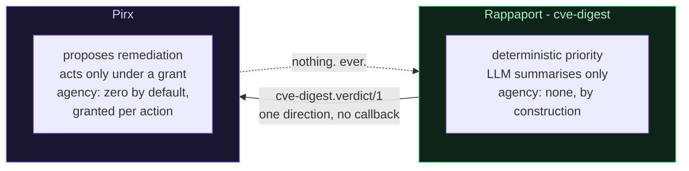
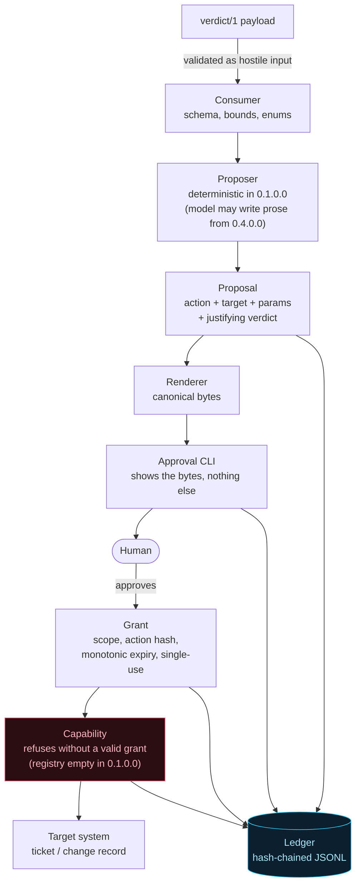

# Pirx

**A write-capable remediation agent whose authority is granted per action, not per session.**

Project brief and first-sprint specification. Self-contained: executable in a
fresh session with no context beyond this file.

```
Brief version:  1.7   (changelog in section 11)
Repository:     github.com/jerzy99jerzy/pirx
Consumes:       cve-digest.verdict/1
Produced by:    github.com/jerzy99jerzy/cve-digest (display codename Rappaport)
Language:       Python 3.14, English throughout
Workflow:       conventions listed in section 8, adopted from cve-digest
                practice. No WORKFLOW.md is vendored here (see F32)
Versioning:     0.MAJOR.FEATURE.MICRO, same four-segment scheme
Status:         shipped through 0.7.2.0; the authoritative version
                state is STATUS.json and README's version plan, never
                this line
```

The name is Lem's pilot: the man who is trusted with a ship precisely because
he treats his own judgement as fallible and checks it against the instruments.
The companion project is named for *His Master's Voice*, where the problem is
that a signal cannot be assumed to mean what its receivers want it to mean.

---

## 0. Why this is a separate repository

Rappaport's claim is absolute and its value comes from being absolute: **the
model decides nothing, ever.** Priority is computed in deterministic code
before any model runs; the model may only summarise what was already ranked; it
has no tools, no writes, no influence on ranking. A reader can verify that claim
by reading one function.

The moment a tool loop, a write path, or a "just this one action" exception
enters that repository, the claim becomes "the model decides almost nothing",
and a security thesis that needs a qualifier has already lost the argument it
was making. So the qualifier lives somewhere else, with its own name, its own
threat model, and a versioned contract between them.



The arrow is one-way and there is no return path. Pirx never writes to
Rappaport, never influences its ranking, never asks it to re-run. If Pirx
learns something that should change priority, that is a finding for a human to
carry back as a change to Rappaport's deterministic rules - not a signal on a
wire. A feedback loop between a ranking system and an agent acting on its
rankings is how an agent learns to rank itself work.

---

## 1. Thesis

> **Approval is a capability grant, not a checkbox.**

Most "human-in-the-loop" agents implement approval as a boolean: a dialogue
appears, a person clicks yes, and from that moment the agent holds whatever
authority it had before the dialogue. The check is real, the authority it
gates is not - because what was approved ("proceed?") and what is then executed
(any action the code can reach) are different things, joined only by the
assumption that the agent will do what it said.

Pirx inverts it, the same way Rappaport inverts "let the LLM decide":

- **Zero authority by default.** No capability is reachable without a grant.
  Not restricted, not discouraged - unreachable, because every write path takes
  a grant as a required argument and refuses without a valid one.
- **A grant authorises one action, not a session.** It is bound to the hash of
  a fully-specified action: verb, target, parameters, and the verdict that
  justified it. A grant for "comment on ticket SEC-412" cannot be spent on
  "comment on ticket SEC-413", let alone on "close SEC-412".
- **Grants expire and are single-use.** Approval given at 09:00 for a
  fifteen-minute window is not authority at 14:00, and a grant that has been
  spent is dead. Both properties exist because the realistic failure is not a
  forged approval; it is a real approval reused in a context nobody reviewed.
- **What was approved is what is shown.** The human sees the rendered action -
  the same bytes that are hashed - not a summary of it produced by the agent.
  An agent that writes its own approval prompt controls the approval.
- **Every grant, spend, and refusal is a structured event.** The ledger is the
  deliverable as much as the agent is: **what was authorised, when, on what
  evidence, and did it run** is the question an auditor asks, and it should be
  answerable with a query rather than an interview. *Who* authorised it is a
  separate question with a separate answer, and section 2 says plainly why this
  project does not claim to answer it.

**The corollary, stated so it cannot be quietly dropped:** the grant machinery
is ordinary code that no model-authored output can reach or influence. The
model proposes prose and selects from a fixed registry; it never issues,
modifies, or validates a grant, and no field it produces is ever a parameter of
one. This is exactly Rappaport's split - judgement in code, prose from the
model - moved up one layer.

*Wording note, deliberate:* elsewhere this document says "the model cannot X"
as shorthand. The precise adversary is never a model reading process memory; it
is **code driven by attacker-controlled data**, and after an eventual process
split, a **second process** asserting authority it was not given. Controls are
written against those, not against a mind.

---

## 2. What Pirx does NOT do

Written before the code, in the register style this codebase family uses,
because naming what a control does not buy is harder than building it and is
the part reviewers actually weigh.

- **It does not decide what is worth fixing.** Priority arrives in the verdict
  and is never recomputed, re-weighted, or overridden. If the priority is
  wrong, that is a defect in Rappaport's deterministic rules and is fixed
  there. An agent that can adjust the ranking that justifies its own actions
  has no meaningful constraint left.
- **It does not act without a human.** There is no autonomous mode, no
  "trusted lane", no threshold above which approval is skipped. The moment a
  configuration flag can disable approval, the security property becomes a
  default rather than a design, and defaults get changed at 02:00 during an
  incident by someone who is not thinking about threat models.
- **It does not patch, deploy, restart, or touch production systems** - not in
  any planned version. Its write surface is the coordination layer: tickets,
  change records, comments, ownership assignment. Remediation is proposed to
  people and systems that already have change control; Pirx does not become a
  second, worse change-control system.
- **It does not authenticate the human, and does not claim the ledger answers
  "who".** A grant proves the approval machinery ran and what it covered. The
  ledger records an `approver_claim` taken from the execution environment,
  carried with an explicit `authenticated: false` marker so no reader can
  mistake it for identity. Whether the person who clicked is who they claim to
  be is the identity provider's job, and pretending a locally-run agent can
  establish it would be theatre. Consequence, stated rather than buried: while
  approval is a local CLI, anyone with a shell on that host holds approval
  authority.
- **It does not authenticate the origin of the verdict payload.** The payload
  is validated as hostile input for shape, but a well-formed payload from an
  attacker who can write to the transport is indistinguishable from a real one.
  See PT14: this is an accepted risk with a named trigger for revisiting, not
  an oversight.
- **It does not trust the verdict because it produced it.** Schema, bounds, id
  format, enumerated values, all enforced on arrival. Between the two projects
  sit a webhook, a SIEM, a queue and somebody's retention storage; trust does
  not cross a boundary because the same person wrote both sides.
- **It does not retain authority between runs.** Grants live for the action
  they authorise. There is no long-lived credential representing "Pirx is
  allowed to work here".
- **It does not propose without limit.** A run has a hard proposal budget. An
  approval surface that presents an unbounded queue converts a capability grant
  back into a checkbox by exhausting the human, and that is a failure of the
  thesis, not of the user. See PT13.

---

## 3. The contract: `cve-digest.verdict/1`

The sole interface. Rappaport emits it; Pirx consumes it. Envelope:

| Field | Meaning |
|---|---|
| `schema` | `cve-digest.verdict/1`. A payload with any other value is refused, not coerced. |
| `verdicts` | The ranked items. |
| `review_lane` | Items the model could not summarise safely; Pirx proposes nothing for these, by design. |
| `notices` | Degradation notices from the producing run. |

Per verdict: `cve_id`, `priority` (P1/P2/P3), `in_kev`, `epss`, `cvss`,
`cvss_pending`, `estate_state`, `vex_status`, `score`, `triage_note`,
`recommended_action`, `nvd_url`.

Three consumption rules that follow from the thesis:

**Facts and prose are separated on arrival.** `triage_note` and
`recommended_action` are model-authored text from the far side of a trust
boundary. They may be shown to a human and carried into a proposal body; they
may never be parsed for intent, matched for keywords that select a capability,
or used to fill an action parameter. The parameters of any action come from the
deterministic fields, from the verdict, or from a human - never from prose.

**`review_lane` is a stop, not a hint.** Those items reached the review lane
because a guardrail fired. Proposing actions for them would route exactly the
items that failed validation into the path with write authority attached. If a
`cve_id` appears in both `verdicts` and `review_lane`, the review lane wins;
this is a test, not an assumption about the producer's behaviour.

**Shape is validated, origin is not.** The consumer establishes that a payload
is well-formed. It establishes nothing about who produced it. Every downstream
control is written as though the payload could have been authored by an
adversary who read the schema.

Contract discipline: a breaking change means `cve-digest.verdict/2`, and Pirx
supports both until it does not. The id is never repurposed.

---

## 4. Architecture

Seven components. Only one of them will ever touch a model, and it does not in
the first version.



**Consumer.** Parses and validates the payload. Refuses unknown schema ids,
out-of-range scores, malformed CVE ids, unenumerated priorities. Produces typed
objects; nothing downstream ever sees the raw dict.

**Proposer.** Deterministic in 0.1.0.0: it maps validated verdict fields onto a
selection from the capability registry, and nothing else. The proposal budget
is consumed **in the order Rappaport ranked the verdicts**, so overflow can
only ever drop the tail of the ranking, never a P1 in favour of a P3; which
ids were budget-refused is itself a ledger event, so the audit trail covers
what was *not* proposed as well as what was. When a model is
admitted at 0.4.0.0, its output is prose plus a *selection among pre-registered
actions* - never a free-form action. The set of actions it may select from is a
registry in code; an action the registry does not contain cannot be named into
existence.

**Renderer.** Turns a proposal into canonical bytes: stable field order, bounded
lengths, escaped text. These bytes are what the human reads and what gets
hashed. One function, so "what was shown" and "what was hashed" cannot diverge.
From 0.4.0.0 the renderer additionally segregates model-authored prose into a
delimited, labelled block that cannot be confused with a deterministic field.
That requirement is recorded now and is an entry condition for admitting a
model, not a later improvement.

**Approval CLI.** Prints the canonical bytes, the age of the proposal, and
reads a decision. It renders nothing of its own, summarises nothing, and
offers no bulk affordance. A terminal is chosen first because it cannot claim
UI affordances it does not have. The age is displayed because grant expiry
(PT4) starts at issue, which happens *after* the human decides - so a human
returning to a terminal hours later is approving a stale *proposal*, not
spending a stale grant. The hash binding guarantees that what runs is exactly
what was shown; the age line exists so the decision is made knowing how old
what was shown is. A decision-quality aid, not an integrity control, and named
as such.

**Grant.** Scope (action hash, target id, verdict id), issued-at, expiry,
nonce, single-use marker. Verification is total: hash match, not expired, not
spent, target match. Any failure is a refusal event, never a warning. In
0.1.0.0 the grant is an in-process object created and consumed inside one run,
so its integrity mechanism is object identity. Section 9 records exactly what
changes that.

**Capability.** The write. Signature takes a grant; the first statement
verifies it. There is no path to the target system that does not pass here, and
that property is guarded by an import-allowlist scrape described in PT7.

**Ledger.** Append-only structured events, same JSONL discipline as Rappaport's
sink, with each record carrying the hash of the previous record: proposal
created, budget refusal, proposal rendered, approval decision, grant issued,
grant spent, grant refused with reason, capability executed with result.
SIEM-ingestable, because the audit trail is half the product.

---

## 5. Threat model

Numbered `PT` to avoid collision with Rappaport's `T` series.

| # | Threat | Control |
|---|---|---|
| PT1 | Malformed or hostile-shaped verdict payload | Schema and bounds validation on arrival; enumerated values only; no prose parsed for intent. Shape only: see PT14 for origin |
| PT2 | Prompt injection in `triage_note` steering the proposer | Proposer selects from a registry, never names an action; parameters come from deterministic fields, never from prose. In 0.1.0.0 there is no model in the loop at all |
| PT3 | Approval reuse - a valid grant spent on a second action | Grant bound to action hash, single-use, marked spent before execution |
| PT4 | Stale approval - authority granted earlier in the run | Short expiry measured on a **monotonic** clock, checked at spend time not issue time. Single process, so there is no clock to skew or roll back |
| PT5 | Substitution - approved for target A, executed on target B | Target id inside the hashed scope; verified at spend |
| PT6 | Agent-authored approval prompt (agent controls what the human sees) | Human is shown the canonical rendered bytes; the same bytes are hashed. From 0.4.0.0, prose is additionally delimited and labelled as untrusted in the render |
| PT7 | Capability reachable without a grant (a new code path forgets) | Grant is a required argument. A build-failing scrape asserts that network and filesystem-write imports appear only in an allowlisted module set, and that no function in those modules lacks a grant parameter. This is a **regression tripwire for the honest mistake**, not a proof against a determined author: indirection defeats any static check, and the document does not claim otherwise |
| PT8 | Privilege accumulation across runs | No persistent credential representing the agent's authority; grants die with their action and with the process |
| PT9 | Ledger tampering or gaps hiding an action | Append-only, each record chaining the previous record's hash, written before execution as well as after. Detects edits and interior gaps without infrastructure; does not detect truncation of the tail, which is what a remote sink buys later |
| PT10 | Feedback loop - agent influencing the priority that justifies it | No write path back to Rappaport; contract is one-way by construction |
| PT11 | Review-lane items reaching the write path | Items in `review_lane` produce no proposals, and win over `verdicts` on collision |
| PT12 | Blast radius - one approval, many targets | One grant, one target, one action; batch approval, if ever added, issues N grants and is refused as a design until PT3-PT5 are proven in production |
| PT13 | **Approval fatigue** - an unbounded proposal queue converts the human into a rubber stamp | Hard proposal budget per run, enforced in code before rendering, consumed in Rappaport's ranking order so only the tail can overflow. Exceeding it is a refusal event naming the excluded ids, not a silently truncated list. The dominant real-world failure of human-in-the-loop systems is not a bypassed check; it is a check the human stopped reading |
| PT14 | **Well-formed payload from an unauthenticated origin** | **Accepted, not controlled.** Shape validation cannot distinguish a real verdict from a plausible forgery. Accepted because the transport is a local file or a local queue on a host the operator already controls, and because the entire write surface is reversible coordination-layer text. Trigger for revisiting: the moment the payload crosses a network or a shared queue, a detached signature from Rappaport becomes required and this row becomes a control row |

---

## 6. Version plan

| Version | Contents |
|---|---|
| **0.1.0.0** | The complete trust loop with **zero capabilities registered**: verdict consumer, deterministic proposer, canonical renderer, approval CLI, grant primitive, hash-chained ledger, proposal budget. A human can run it end to end, see a rendered proposal, approve it, and watch the spend be refused because nothing is registered. Threats PT1-PT9, PT11, PT13, PT14 addressed and tested. Nothing can write anything, by construction and by test. |
| 0.2.0.0 | The hostile-agent harness: a scripted proposer that attempts every PT, in CI, on every run. This is the verification vehicle and it lands before any write. |
| 0.3.0.0 | First capability: append a comment to an existing ticket. Chosen because it is the smallest genuine write - visible, reversible, and useless to an attacker who obtains it. Brings execution semantics with it: at-most-once, an `outcome_unknown` ledger event, and an idempotency key derived from the action hash. |
| 0.4.0.0 | The model enters the proposer, and the renderer's untrusted-prose segregation lands with it. PT2 and PT6 become live threats here rather than theoretical ones, which is why this follows a working write path rather than preceding it. |
| **0.5.0.0** | Attentive approval (PT15): content-derived challenge, reading floor, session grant budget, `AttentionEvidence` verified at issuance, attention events in the ledger, harness attacks A31-A35. No gate code. Supersedes the former 0.5.0.0 row ("second capability: create a change record") - the substitution is recorded in the v1.4 changelog, not made silently; the second capability returns as the first gated tool at 0.7.0.0. |
| 0.6.0.0 | The justification-source abstraction: the verdict path becomes adapter #1 with zero behaviour change, proven by the existing suite passing unmodified; `CONTRACT.md` grows the abstraction. |
| **0.7.0.0** | The gate, and the three coupled format changes it forces: `pirx.proposal/2` (justification in the preimage, `verdict` removed), `pirx.ledger/2` (field rename, both formats still readable), `pirx.intercepted-call/1` (adapter #2). Ships the pair settled decision 2 owed - HMAC grants **and** a durable spend store, together. `pirx-gate` intercepts `tools/call`, `pirx gate-approve` is the out-of-band surface, `pirx verify` reads either ledger format. Threat rows PT16-PT20; harness A37-A42d. Gated registry empty, as the capability registry was in 0.1.0.0. |
| **0.7.1.0** | `pirx-gate` becomes a process: the stdio pump (framing, bounded frames, a downstream child, stdout that carries protocol only), harness A44-A47, and `docs/MANUAL.md` - the first operator-facing document the project has had. |
| 0.7.2.0 | `docs/MANUAL.md` v2.0, the full operator manual, and `tools/manual_audit.py` - a fifth required CI check that fails when the manual's stated facts drift from the code. Shipped without a row in this table until brief v1.7, which is the drift the audit tools do not cover: they check pins and markers, not whether a shipped version was planned. |
| 0.8.0.0 | `pirx verify` report including the fatigue signal derived from attention events (T8's new owner); attestation export mapping ledger evidence to EU AI Act art. 14 / ISO 42001 demonstrable-oversight language. |
| 0.9.0.0 | Streamable HTTP transport for the gate, which is stdio-only today. Carries two things the transport forces rather than invites: the stdlib-only constraint, amended in this brief with reasons if the standard library cannot carry it honestly rather than worked around in code; and **PT14's trigger, which this version fires** - a payload crossing a network makes the detached signature a control row instead of an accepted risk. Re-homed from `docs/TODO.md` in brief v1.7, where it was scope living in a file whose own header excludes scope. |

The ordering is deliberate and mirrors Rappaport's: the trust machinery ships
and is tested against an adversary **before** the thing it protects exists. The
change from brief v1.0 is that the approval surface is part of that machinery,
not a follow-up to it. A version that can issue grants but has no way for a
human to approve one would have to invent a programmatic approval path, which
is the exact anti-pattern section 1 exists to reject.

### 6.1 What 1.0.0.0 means

Through brief v1.6 the plan had a last row and no terminus. "How many sprints
remain" was therefore unanswerable, not because the answer was large but
because the denominator did not exist - an unowned condition of exactly the
kind P12 refuses when it appears anywhere else in the project. This subsection
gives it an owner. It is settled in the sense section 9 uses: amended by a
brief bump with reasons, not re-argued mid-sprint.

**1.0.0.0 is the version at which the project stops calling itself greenfield
and starts making production claims.** It is reached when every condition
below holds, and on no date:

1. **Both transports are real.** The gate runs over stdio and over streamable
   HTTP (0.9.0.0). A gate that only survives a child it spawned itself has not
   met the deployment shape most operators actually have.
2. **PT14 is a control row, not an accepted row.** Its own trigger fires at
   0.9.0.0, so a 1.0.0.0 shipping a network transport with the payload still
   unauthenticated would contradict the row that accepted the risk. The
   detached signature comes due with the transport, not with the major digit.
3. **The attentive-approval claim carries a measurement, not only a control.**
   0.8.0.0's fatigue report exists, has been run against approvals from real
   use rather than from the harness, and its wording is bounded by what that
   sample supports (P7). The known trap is recorded already: `elapsed_seconds`
   measures presence at a terminal, so the signal is built on the lower tail
   of a distribution, never on a raw value.
4. **No open item is owned by a version at or below 1.0.0.0**, in section 9's
   deferral table or in `docs/TODO.md`. Trigger-owned items whose trigger has
   not fired are not blockers; that is the difference between a deferral and
   an omission.
5. **Every audit the repository runs against its own documents is green**, and
   no strength-word in the docs describes behaviour the suite does not
   produce.

**What 1.0.0.0 does not mean**, stated because the negative space is where
this project's claims are load-bearing (P2):

- Not the process split into a separate executor, and therefore not the Rust
  question. That row keeps its own owner - the first multi-process version -
  and 1.0.0.0 does not require one.
- Not Windows. The identity launcher keeps its trigger; `docs/IDENTITY-WINDOWS.md`
  exists precisely so the code is not written ahead of the research.
- Not autonomy, not a threshold that skips approval, not a configurable
  security limit. Those are not scope at any version, so no version can be
  the one that grants them.
- Not schema stability beyond P8. A breaking change after 1.0.0.0 gets a new
  contract id exactly as before; the major digit buys the contract nothing.

Counting from 0.7.2.0, that is three planned versions - 0.8.0.0, 0.9.0.0,
1.0.0.0 - with the caveat that condition 3 depends on accumulating real
approvals rather than on writing code, and is the one condition a sprint
cannot close by itself.

---

## 7. Sprint 0.1.0.0, in detail

```
Branch:         feat/trust-loop (and successors)
Base:           main at repository creation
Target version: 0.1.0.0
Invariants:     zero capabilities registered; every write path takes a grant;
                one process, one run, no persistent authority
```

### 7.1 Modules

```
pirx/
  consumer.py     verdict/1 parsing and validation
  proposal.py     Proposal, canonical rendering, action hash
  proposer.py     deterministic verdict -> proposal mapping, budget enforcement
  grant.py        Grant, issue, verify, spend
  approve.py      CLI approval surface
  registry.py     capability registry (empty in this version)
  ledger.py       hash-chained append-only JSONL event sink
  errors.py       refusal types, each one a named event
docs/
  THESIS.md       section 1 of this brief, expanded
  THREAT-MODEL.md section 5, one page per threat, including PT14 as accepted
  CONTRACT.md     section 3, the compatibility policy, and the consumer-owned
                  compatibility matrix (which Pirx versions accept which
                  verdict schema ids)
  FAMILY.md       vendored verbatim from cve-digest, version pinned in header
  exchange/       development-level exchange entries (PX-NNNN.md and RP
                  mirrors), per FAMILY.md section 3
tests/
  test_consumer.py, test_grant.py, test_proposal.py, test_approve.py,
  test_budget.py, test_ledger_chain.py, test_no_capabilities.py
STATUS.json       machine-readable project status per FAMILY.md 3.4; read by
                  humans and exchange entries, never by the other repository
```

### 7.2 The tests that define the version

- A payload with a schema id other than `cve-digest.verdict/1` is refused.
- Every field is bounds-checked; a 50 KB `triage_note` is truncated at parse
  time, not at render time.
- A grant verifies only against the exact bytes it was issued for; changing one
  character of the rendered proposal invalidates it.
- A spent grant cannot be spent again, and the second attempt is a refusal
  event carrying the reason.
- An expired grant is refused at spend time even though it was valid at issue,
  with expiry driven by a monotonic clock the test can advance.
- A grant for target A is refused against target B.
- **The registry is empty**, and the import-allowlist scrape proves no module
  outside the allowlist imports a network or filesystem-write facility, and
  that no allowlisted write function lacks a grant parameter. This test exists
  from day one so the property is established before the first capability
  rather than retrofitted around it.
- Items in `review_lane` produce no proposals, including when the same
  `cve_id` also appears in `verdicts`.
- A run producing more proposals than the budget emits a budget refusal event
  that names every excluded `cve_id`, renders none of the overflow, and the
  rendered set is exactly the top of Rappaport's ranking order.
- The bytes the approval CLI writes to the terminal are byte-identical to the
  bytes the action hash covers, proven by capturing stdout in the test rather
  than by comparing two calls to the renderer.
- The ledger chain's genesis record hashes a fixed, documented sentinel, so a
  verifier can distinguish "fresh ledger" from "file whose head was replaced".
- Editing any ledger record breaks the chain and is detected by a verifier that
  ships in the same module.

### 7.3 What ships in the documentation, same version

The thesis, the threat model with all fourteen entries including the accepted
one, and the register from section 2. Rappaport's precedent is explicit here:
the trust argument is the deliverable, and a version that ships the machinery
without the argument has shipped the less valuable half.

---

## 8. Conventions inherited from cve-digest

Adopted verbatim, because they were paid for in incidents:

- Four-segment versioning; the version bump is its own commit; rebase merge,
  squash forbidden on any PR carrying a bump.
- Branch protection with `enforce_admins`, required checks by their check-run
  names, auto-merge as a repository setting.
- Local gate before push: ruff, mypy, `python -m pytest`, docs audit.
- A verification and the action it guards never share a pasted block.
- A docs audit runs in the gate (`tools/docs_audit.py`), checking pin
  consistency, review coverage, catalogue count, and PT numbering.
- Explicit file lists; never `git add -A`.
- Docstrings register what a module does **not** do, with reasoning.
- Claims are measured, not asserted. A number in the documentation is either
  something the code produced or it is not in the documentation.
- Pre-push code review in `docs/reviews/`, findings dispositioned as fixed,
  accepted with reasons, or deferred.

---

## 9. Decisions settled, and what is deliberately not built yet

Replaces the open-questions section of v1.0. Everything below is a decision, so
that none of it is re-argued mid-sprint.

**Settled.**

1. **Grant integrity in 0.1.0.0 is object identity.** One process issues,
   approves, and spends within a single run, so an in-process object is not a
   weaker version of the real mechanism, it is the correct mechanism for this
   topology. No HMAC, no signing key, no key management.
2. **The trigger for changing that is precise:** the first version in which
   approval and execution are separate processes. At that point an HMAC over
   the scope and a **persistent spend store** land together, in the same
   version, because an integrity-protected grant that is verifiable statelessly
   and has no durable spend record is replayable across restarts. Either both
   or neither; that coupling is the reason this is written down rather than
   left to a future judgement call.
3. **Ledger is a local hash-chained JSONL file.** A remote append-only sink is
   the honest answer to tail truncation and it is not an MVP concern; the chain
   covers edits and interior gaps for the cost of one field.
4. **No model in 0.1.0.0.** A deterministic proposer produces a valid proposal
   from the verdict fields alone, and the grant machinery is what this version
   is about. This also means PT2 has nothing to attack in the first version,
   which is a real reduction in scope rather than a rhetorical one.
5. **Proposal budget is a constant in code**, not configuration. A configurable
   budget is a disabled budget on the day someone is in a hurry.
6. **The implementation language is Python, for every version this brief
   plans.** Considered and settled after 0.1.0.0 shipped, so it does not
   return each sprint. The reasons are independent of any language's merits:
   a working, tested trust loop already exists; the family shares one gate,
   one workflow, and one set of conventions with Rappaport, and a language
   split in a one-author family doubles the cost of everything FAMILY.md
   codifies; the model enters at 0.4.0.0, where Python is the natural
   integration environment; and Pirx has no hot path - the bottleneck is a
   human reading bytes in a terminal. C++ specifically is rejected outright,
   not deferred: a memory-unsafe runtime adds threat classes PT1-PT14 never
   had to name, in a project whose thesis is that controls must not be
   optional. The one boundary where the question legitimately returns is
   recorded in the deferral table below, with Rust - not C++ - as the named
   candidate, because move semantics and typestate would let a compiler
   enforce single-use and staged authority natively.

**Deliberately deferred, with the version that owns it.**

| Deferred | Owned by | Why not now |
|---|---|---|
| HMAC grants + persistent spend store | first multi-process version | No process boundary exists to defend |
| Detached signature on the verdict payload | first networked transport | PT14 accepted while transport is local |
| Remote append-only ledger sink | after first capability | Chain covers the failure modes that exist without a write path |
| At-most-once semantics, `outcome_unknown`, idempotency key | 0.3.0.0 | There is nothing to execute, so nothing to reconcile |
| Untrusted-prose segregation in the renderer | 0.4.0.0 | No model prose exists before then; entry condition for the model, not an improvement |
| Language of the execution component (Rust as the named candidate) | first multi-process version | Reopen at the process split, not before. That split (settled decision 2: HMAC grants + durable spend store) is the only architectural boundary where a language change has substance: a small, separately verifiable Rust executor consuming HMAC grants issued by the Python core would put the trust-enforcing component in a language whose compiler proves single-use by move semantics, while orchestration and the model stay in Python. Until that boundary exists, a rewrite is exactly the scope this table exists to refuse |
| Batch approval | not planned | PT12 refuses it as a design until PT3-PT5 are proven in production |

**Still genuinely open, and cheap to answer during the sprint.**

- **Which ticketing system first.** Rappaport already speaks to Jira and Azure
  DevOps. Reusing one of those adapters means the first capability is a comment
  on a ticket Rappaport itself created, which is a clean end-to-end story and a
  real integration rather than a demo. Decide at 0.3.0.0, not before; it does
  not affect anything in 0.1.0.0.

---

## 10. Development-level continuity with Rappaport

Governed by `docs/FAMILY.md`, vendored from cve-digest, which carries the
extracted family practices (P1-P13) and the exchange protocol. What matters at
the level of this brief:

- **The runtime rule and the development rule are different rules, and both
  are absolute.** PT10 forbids any wire from Pirx back to Rappaport at
  runtime. FAMILY.md section 1 forbids any *automation* in either repository
  from reading or writing the other's state at development time - no CI drift
  checks, no status fetches, no shared pipelines. Everything that crosses,
  crosses as a file in `docs/exchange/`, carried by a person. The sentence in
  section 0 - "a finding for a human to carry back" - now has a defined
  vehicle instead of being an aspiration.
- **Status is published, never pulled.** Each repository maintains its own
  `STATUS.json` (version, contract ids produced or consumed, pinned family
  and workflow versions). It exists for the human and for exchange entries to
  reference. The compatibility matrix has one owner: Pirx, as the consumer,
  in `docs/CONTRACT.md`.
- **Contract evolution has a path.** A change to `cve-digest.verdict/*` starts
  as a `contract-proposal` exchange entry; breaking changes take a new schema
  id per family practice P8, and Pirx's matrix records the overlap window.
- **This brief's own conventions feed back.** Practices born here (accepted
  risk with a trigger, coupled controls, security constants) are registered in
  FAMILY.md so Rappaport inherits them deliberately - through an exchange
  entry, not through the author's memory.

---

## 11. Changelog

**v1.7** - drift repair, and the terminus the plan never had.

- **Section 6.1 defines 1.0.0.0.** Five conditions, four explicit
  non-conditions. Until now the version plan ended at its last planned row,
  which made "what is left" a question with no denominator - the project
  enforced owned deferrals everywhere except on its own finish line.
- **0.7.2.0 gets a row.** It shipped, was reviewed, and appeared in README's
  plan while the brief's plan skipped from 0.7.1.0 to 0.8.0.0. `docs_audit.py`
  did not catch it because it checks pins, review files, and the position
  marker - not whether a shipped version was ever planned.
- **0.9.0.0 promoted from `docs/TODO.md` to the version plan.** The streamable
  HTTP transport changes what Pirx does, and TODO's own header excludes such
  items. Its promotion also makes explicit what the TODO entry left implicit:
  the transport fires PT14's trigger, so the detached signature is owed by
  0.9.0.0.
- Header corrected: the repository is no longer "to be created", and the
  `Status` line no longer says "greenfield, nothing written" long after
  the first ship. Version state is pointed at STATUS.json rather than
  restated, so there is one owner for the question.

**v1.6** - the pump, and the manual.

- `pirx-gate` is a process. 0.7.0.0 shipped the whole decision path and no way
  to run it; `pirx/mcp/pump.py` and the `pirx-gate` console script close that,
  and the documentation that described the process in the present tense is now
  accurate rather than aspirational.
- The package scrape's process-reach rule is restated rather than widened: the
  pump may spawn, and **the only argv it may spawn is the one the operator
  typed at launch** - asserted structurally, since nothing from a payload, a
  tool definition, or a model may reach it.
- `docs/MANUAL.md`: the operator-facing document. Both entry points, the
  approval prompt explained, ledger reading, an exit-code table, and every
  typed refusal with its usual cause.
- Harness A44-A47 cover the properties a transport can break without the gate
  noticing: frame boundaries, an oversized line that must be drained rather
  than split, a dead downstream that must not be reported as a refusal, and
  stdout carrying protocol only.

**v1.5** - the gate, and the format changes it forces. Load-bearing changes:

- **Three schema ids move in one version, never three** (P5's spirit, P8's
  rule): `pirx.proposal/2`, `pirx.ledger/2`, `pirx.intercepted-call/1`.
  `Proposal.verdict` is removed: with adapter #2 the field is not redundant
  but false, and the lie propagated into the grant and into the ledger an
  auditor reads (F43). `/1` is retired as a *writer*; `verify_chain` still
  reads it, because a hash chain nobody can check is not an audit trail.
- **Settled decision 2 comes due and is paid in full.** The gate splits
  approval from execution, so the HMAC over the grant scope and the durable
  spend store land together. Two costs, named rather than discovered: expiry
  moves to the wall clock (a backwards clock extends a grant), and a grant
  becomes a copyable artefact (the MAC makes forgery hard, the store makes a
  copy useless, nothing makes the file secret).
- **PT16-PT20 added.** Tool-definition drift; approval routed through the
  party under review (MRTR is a poll ticket only); gate bypass, accepted as
  evidentiable rather than preventable; process-identity forgery, accepted
  with the Windows research that explains why the macOS story does not
  transfer; header/body divergence at the transport.
- The gated registry ships **empty**, exactly as the capability registry did
  in 0.1.0.0 (P3).
- MCP facts throughout are read from the 2026-07-28 specification at source,
  not from memory; `docs/GATE-RESEARCH.md` carries the note with epistemic
  labels.

**v1.4** - the strategic reframe becomes plan. Load-bearing changes:

- Version plan extended through 0.8.0.0 along the two axes accepted from the
  session's market reading (`docs/PIRX-GATE-DESIGN.md`): the MCP gate as the
  insertion point, proof-of-read as what makes the gate non-trivial. The
  thesis is unchanged; the verdict pipeline becomes one adapter of a general
  justification-source mechanism at 0.6.0.0, which is why this is a brief
  bump and not a new brief (the H1 test: the grant's anchor - bound to bytes,
  spent before execution, model outside the machinery - does not move).
- **Scope substitution at 0.5.0.0, made explicitly:** the settled row
  "second capability: create a change record" is superseded by attentive
  approval (PT15). Rationale: B1 was the thesis's named weakest link, and a
  second capability would have widened the write surface while the approval
  covering it remained unmeasured. The change-record capability returns as
  the first gated tool at 0.7.0.0. Owner's sign-off: instruction to execute
  the gate design, 2026-08-08.
- PT15 added to the threat model: approval-attention exhaustion, with
  content-derived challenge, reading floor, session grant budget, and
  issuance re-verification as controls; comprehension named as the residual
  no measurement here supports. PT13 remains the volume bound; PT15 is the
  evidentiary quality of each approval within it.
- `AttentionEvidence` becomes a required field of `ApprovalDecision`,
  verified again at issuance, so the surface measures attention and the
  issuer enforces it (ARCHITECTURE A13).
- Harness grows A31-A35, the scripted inattentive approver.
- T8 (`pirx verify`) re-owned from 0.5.0.0 to 0.8.0.0, where the report can
  include the fatigue signal the attention events now make derivable.

**v1.3** - language decision recorded so it stops returning. New settled
decision 6: Python for every planned version, with the reasoning written out
(working tested loop, family coherence per FAMILY.md, model entry at 0.4.0.0,
no hot path); C++ rejected outright on memory-safety grounds rather than
deferred. New deferral row: language of the execution component, owned by the
first multi-process version, Rust as the named candidate - the
approval/execution split is the only boundary where the question has
substance, and its owner is now written down instead of implied.

**v1.2** - review of v1.1 plus the continuity layer. Load-bearing changes:

- Component count in section 4 corrected: seven, not six. A counting error in
  a document whose family rule is "claims are measured" is small and exactly
  the kind of thing the rule exists for.
- Proposal budget made order-aware: consumed in Rappaport's ranking order, so
  overflow can only drop the tail; excluded ids are named in the refusal
  event. Without this, PT13's control could silently starve a P1 - a budget
  that can do that is a new threat, not a control.
- Approval CLI now displays proposal age, with the reasoning spelled out: PT4
  covers the grant, not the human's absence before approval; the age line is a
  decision-quality aid and is labelled as such rather than dressed up as an
  integrity control.
- Three tests added: stdout byte-equality for the approval surface (closing
  the last gap in PT6's "shown bytes are hashed bytes" for the CLI itself),
  ledger genesis sentinel (distinguishing a fresh ledger from a replaced
  head), and budget refusal naming its exclusions.
- New section 10 and `docs/FAMILY.md`: extracted family practices and the
  development-level exchange protocol - asynchronous, file-based,
  human-carried, with automation across the repository boundary explicitly
  forbidden so the continuity loop cannot erode into the feedback loop PT10
  exists to prevent.
- `STATUS.json`, `docs/exchange/`, and the consumer-owned compatibility
  matrix added to the 0.1.0.0 tree. None of it is runtime surface; all of it
  is files a human reads.

**v1.1** - applied a pre-write review of v1.0. Load-bearing changes:

- Approval CLI moved **into** 0.1.0.0. v1.0 shipped two capabilities (0.3, 0.4)
  before the approval surface (0.5), which would have required a programmatic
  approval path during the versions that had a live write path.
- Resolved the contradiction between the section 1 claim that the ledger
  answers "who authorised what" and the section 2 statement that the human is
  not authenticated. Section 1 now claims what the ledger can prove; section 2
  adds `approver_claim` with an explicit unauthenticated marker.
- PT1 restated to claim only what shape validation delivers. Added **PT14** for
  a well-formed payload from an unauthenticated origin, recorded as an accepted
  risk with a named trigger rather than left implicit.
- Added **PT13**, approval fatigue, with a hard proposal budget as its control.
- PT4 pinned to a monotonic clock, which is free in a single-process design and
  removes an unstated trust assumption about time.
- PT7 reworded from "enforced" to a regression tripwire, and strengthened from
  a method scrape to an import-allowlist scrape, which is harder to bypass by
  accident. The previous wording overclaimed against this codebase family's own
  rule that claims are measured rather than asserted.
- Ledger records now chain the previous record's hash, giving PT9 a control in
  0.1.0.0 instead of a deferral.
- `review_lane` precedence over `verdicts` on `cve_id` collision made explicit
  and testable.
- Open questions converted into settled decisions plus a deferral table with
  owning versions. In particular, v1.0's recommendation to build HMAC grants
  from the start is **reversed** for 0.1.0.0 and replaced with a precise
  trigger, because a single-process run has no boundary an HMAC would defend,
  and a stateless-verifiable grant without a durable spend store is a
  regression against PT3.
- Model entry moved after the first capability. v1.0 introduced both at
  0.3.0.0; separating them means the first write path ships with a
  deterministic proposer.
- Added a wording note in section 1: "the model cannot X" is shorthand, and the
  real adversaries are attacker-influenced code and, later, a second process.
